<div align="center">

# 黑科制造 MES 系统

## 产 品 说 明 书

### （智能制造执行系统 · PRO 版）

<br/>

**Manufacturing Execution System — User Manual**

<br/>
<br/>

| 项目 | 内容 |
| :--- | :--- |
| 产品名称 | 黑科制造 MES 系统（MES 系统-PRO） |
| 文档类型 | 产品使用说明书 / 操作手册 |
| 文档版本 | V1.0 |
| 技术架构 | Spring Boot · MyBatis-Plus · MySQL · Redis · Shiro · FreeMarker · layui |
| 适用版本 | 单模块版（代码位于 `mes/`） |
| 编制日期 | 2026-06-13 |
| 访问地址 | http://localhost:9090 |
| 默认账号 | admin / 123 |

</div>

<div style="page-break-after: always;"></div>

---

## 文档说明

本说明书面向**系统管理员、计划员、工艺工程师、仓储管理员、车间班组长与操作工**等使用角色，系统、完整地介绍黑科制造 MES 系统的全部功能模块、操作流程与业务规则。

- 文中所有界面截图均来自系统真实运行环境（演示数据：以"台式电脑主机（PC_HOST）"为主线的整机装配业务）。
- 文中"路径"指浏览器访问地址或左侧导航菜单的层级位置。
- 文中"状态值"约定：`0` 正常、`1` 删除（软删，不物理删除）、`2` 禁用。
- 阅读建议：初次使用者先阅读「第 1~3 章」了解总体与通用操作，再按「第 16 章 典型业务全流程」走通一遍，即可掌握系统主干。

---

## 目录

- [第 1 章 产品概述](#第-1-章-产品概述)
  - [1.1 产品定位](#11-产品定位)
  - [1.2 核心价值](#12-核心价值)
  - [1.3 技术架构](#13-技术架构)
  - [1.4 功能地图](#14-功能地图)
- [第 2 章 运行环境与部署](#第-2-章-运行环境与部署)
  - [2.1 运行环境要求](#21-运行环境要求)
  - [2.2 构建与启动](#22-构建与启动)
  - [2.3 数据库脚本](#23-数据库脚本)
- [第 3 章 登录与主界面](#第-3-章-登录与主界面)
  - [3.1 登录系统](#31-登录系统)
  - [3.2 主界面与导航](#32-主界面与导航)
  - [3.3 通用操作规范](#33-通用操作规范)
- [第 4 章 系统管理](#第-4-章-系统管理)
  - [4.1 菜单管理](#41-菜单管理)
  - [4.2 用户管理](#42-用户管理)
  - [4.3 角色管理](#43-角色管理)
  - [4.4 部门管理](#44-部门管理)
- [第 5 章 基础数据中心](#第-5-章-基础数据中心)
  - [5.1 班组员工定义](#51-班组员工定义)
  - [5.2 编组设备定义](#52-编组设备定义)
  - [5.3 加工单元定义](#53-加工单元定义)
  - [5.4 设备管理](#54-设备管理)
  - [5.5 库房库位定义](#55-库房库位定义)
  - [5.6 库存管理](#56-库存管理)
- [第 6 章 产品数据中心](#第-6-章-产品数据中心)
  - [6.1 物料信息定义](#61-物料信息定义)
  - [6.2 零部件定义](#62-零部件定义)
  - [6.3 产品 BOM 管理](#63-产品-bom-管理)
- [第 7 章 工艺管理中心](#第-7-章-工艺管理中心)
  - [7.1 工序信息定义](#71-工序信息定义)
  - [7.2 工艺路线管理](#72-工艺路线管理)
  - [7.3 工艺流程管理](#73-工艺流程管理)
  - [7.4 工艺内容编制](#74-工艺内容编制)
  - [7.5 产品工艺查询](#75-产品工艺查询)
- [第 8 章 生产计划中心](#第-8-章-生产计划中心)
  - [8.1 生产订单录入](#81-生产订单录入)
  - [8.2 设备作业派工](#82-设备作业派工)
  - [8.3 员工作业派工](#83-员工作业派工)
  - [8.4 物料需求计划（明细）](#84-物料需求计划明细)
  - [8.5 物料需求计划（查询）](#85-物料需求计划查询)
  - [8.6 入库申请单](#86-入库申请单)
  - [8.7 生产计划下发](#87-生产计划下发)
  - [8.8 生产工单查询](#88-生产工单查询)
- [第 9 章 计划管理](#第-9-章-计划管理)
  - [9.1 工单管理](#91-工单管理)
  - [9.2 已交付工单](#92-已交付工单)
- [第 10 章 库房管理中心](#第-10-章-库房管理中心)
  - [10.1 手工入库申请 / 确认](#101-手工入库申请--确认)
  - [10.2 计划入库确认](#102-计划入库确认)
  - [10.3 手工出库申请 / 确认](#103-手工出库申请--确认)
  - [10.4 配套出库确认](#104-配套出库确认)
  - [10.5 库存明细查询](#105-库存明细查询)
  - [10.6 出入库流水查询](#106-出入库流水查询)
- [第 11 章 在制品管理](#第-11-章-在制品管理)
  - [11.1 SN 通用过程采集](#111-sn-通用过程采集)
- [第 12 章 流程配置工具](#第-12-章-流程配置工具)
  - [12.1 流程办理](#121-流程办理)
  - [12.2 流程分类管理](#122-流程分类管理)
  - [12.3 流程模型设计](#123-流程模型设计)
  - [12.4 流程定义管理](#124-流程定义管理)
  - [12.5 流程实例管理](#125-流程实例管理)
  - [12.6 流程任务管理](#126-流程任务管理)
- [第 13 章 数字化平台](#第-13-章-数字化平台)
  - [13.1 智慧大屏](#131-智慧大屏)
  - [13.2 智能制造数据中心](#132-智能制造数据中心)
- [第 14 章 黑科数字孪生](#第-14-章-黑科数字孪生)
  - [14.1 数字仿真 3D 仓库](#141-数字仿真-3d-仓库)
- [第 15 章 智能助手中心](#第-15-章-智能助手中心)
  - [15.1 智能数据助手](#151-智能数据助手)
  - [15.2 AI 智能建模](#152-ai-智能建模)
- [第 16 章 典型业务全流程演练](#第-16-章-典型业务全流程演练)
- [第 17 章 附录](#第-17-章-附录)
  - [17.1 角色与权限](#171-角色与权限)
  - [17.2 状态值与字典](#172-状态值与字典)
  - [17.3 常见问题（FAQ）](#173-常见问题faq)

<div style="page-break-after: always;"></div>

---

# 第 1 章 产品概述

## 1.1 产品定位

黑科制造 MES（Manufacturing Execution System，制造执行系统）是一套面向离散制造企业的**生产现场管控平台**，定位于连接上层 ERP/订单与底层车间执行的中枢。系统围绕"**基础数据 → 产品与工艺设计 → 生产计划 → 派工下发 → 现场执行采集 → 库房物料管控 → 数据可视化**"这一主线，将基础数据、工艺、计划、物料、现场执行、审批流程与数据可视化统一在一个平台内，做到**过程清晰可视、数据可追溯**。

> 系统登录页标语：**"面向生产计划、工艺流转、物料追踪与现场执行的智能制造中枢。"**

## 1.2 核心价值

| 能力维度 | 说明 |
| :--- | :--- |
| 全链路数据贯通 | 物料 → 零部件 → BOM → 工艺路线 → 工序内容 → 生产订单 → 工单 → 派工 → 过站采集 → 出入库，环环相扣，单据可上下追溯。 |
| 三层 BOM 结构 | 支持"产品 BOM / 半成品 BOM / 组件 BOM"多层级嵌套，通过子 BOM 关联形成完整的物料清单树。 |
| 工艺规划与锁定 | 工艺流程支持按 BOM 初始化、草稿编辑、锁定定版，锁定后不可随意更改，保障现场执行依据稳定。 |
| 智能排产与派工 | 生产订单审核后自动 MRP 运算，并支持设备/员工两级派工，员工派工内置**负载均衡**算法。 |
| 闭环库房管理 | 申请—确认两段式作业，入出库均生成不可跳过的库存流水，支持手工/计划/配套等多种业务类型。 |
| 可配置审批流程 | 内置轻量工作流引擎（分类—模型—定义—实例—任务—办理），订单审批、工单变更审批等业务可挂接审批。 |
| 数据可视化 | 提供"智慧大屏"与"智能制造数据中心"两套大屏，以及 3D 数字孪生仓库。 |
| AI 智能辅助 | 接入通义千问大模型，提供"智能数据助手（自然语言查询）"与"AI 智能建模（产品→BOM→工艺→工单四步向导）"。 |

## 1.3 技术架构

| 层次 | 选型 |
| :--- | :--- |
| 运行平台 | Java 11 |
| 应用框架 | Spring Boot（单模块） |
| 持久层 | MyBatis-Plus + MySQL，Druid 连接池 |
| 缓存 | Redis、EhCache |
| 安全鉴权 | Apache Shiro（用户/角色/菜单权限） |
| 视图层 | FreeMarker（`.ftl` 模板）服务端渲染 |
| 前端 | layui + 自封装 `sp*` 组件（spTable / spLayer / spUtil） |
| 大模型 | 通义千问 DashScope（OpenAI 兼容接口，SSE 流式 + 工具调用） |

系统采用经典的**服务端渲染 + 异步取数**模式：页面框架由 FreeMarker 渲染，列表数据通过 `POST` 接口异步加载到自封装的 `spTable` 组件，编辑/选择类弹窗统一由 `spLayer` 承载。每个业务域按 `controller / entity / mapper / request / service` 分层组织。

## 1.4 功能地图

系统功能按"业务中心"组织，左侧导航树共分为以下一级/二级分组：

```
常规管理
├─ 系统管理 ………………… 菜单 / 用户 / 角色 / 部门
├─ 基础数据中心 ………… 班组员工 / 编组设备 / 加工单元 / 设备 / 库房库位 / 库存
├─ 产品数据中心 ………… 物料信息 / 零部件 / 产品 BOM
├─ 工艺管理中心 ………… 工序信息 / 工艺路线 / 工艺流程 / 工艺内容编制 / 产品工艺查询
├─ 库房管理中心 ………… 手工入库申请·确认 / 计划入库确认 / 手工出库申请·确认 / 配套出库确认 / 库存明细 / 出入库流水
├─ 流程配置工具 ………… 流程办理 / 流程管控（分类·模型·定义·实例·任务）
├─ 生产计划中心 ………… 生产订单录入 / 设备派工 / 员工派工 / 物料需求计划（明细·查询） / 入库申请单 / 生产计划下发 / 生产工单查询
├─ 计划管理 ……………… 工单管理 / 已交付工单
├─ 在制品管理 …………… SN 通用过程采集
├─ 数字化平台 …………… 智慧大屏 / 智能制造数据中心
├─ 黑科数字孪生 ………… 数字仿真 3D 仓库
└─ 智能助手中心 ………… 智能数据助手 / AI 智能建模
```

<div style="page-break-after: always;"></div>

---

# 第 2 章 运行环境与部署

## 2.1 运行环境要求

| 组件 | 要求 | 默认配置 |
| :--- | :--- | :--- |
| JDK | Java 11 | — |
| 数据库 | MySQL，库名 `sparchetype` | dev 连接 `127.0.0.1:3306` |
| 缓存 | Redis | `127.0.0.1:6379` |
| 服务端口 | 9090（无 context-path） | `server.port=9090` |
| 浏览器 | Chrome / Edge 等现代浏览器 | 推荐分辨率 ≥ 1440×900 |
| 上传目录 | 文件上传路径 | `D:/mes/upload`，访问前缀 `/upload` |

## 2.2 构建与启动

项目通过项目内的 Maven 配置文件 `.codex-maven-settings.xml`（阿里云镜像 + 项目内本地仓库）进行构建。常用命令（PowerShell）：

```powershell
# 启动应用（跳过测试）
mvn -s .\.codex-maven-settings.xml -f .\mes\pom.xml -DskipTests spring-boot:run

# 仅编译 / 打包
mvn -s .\.codex-maven-settings.xml -f .\mes\pom.xml -DskipTests compile
mvn -s .\.codex-maven-settings.xml -f .\mes\pom.xml -DskipTests package
```

启动成功后，浏览器访问 **http://localhost:9090** 即可进入登录页。默认激活 `dev` 配置（`application-dev.yml`）。

## 2.3 数据库脚本

系统**不使用** Flyway/Liquibase 自动迁移，所有结构变更与演示数据均以 SQL 脚本形式存放于 `scripts/sql/`，需**手动执行**。脚本均为可重复执行（`IF NOT EXISTS` / `INSERT IGNORE` / `NOT EXISTS` 子查询）。

> **提示**：执行 SQL 脚本导入中文数据时，须指定字符集 `--default-character-set=utf8mb4`，否则中文会乱码。完整演示数据可通过 `demo-data-full-reset-*.sql` 一键重建。

<div style="page-break-after: always;"></div>

---

# 第 3 章 登录与主界面

## 3.1 登录系统

**访问路径**：`http://localhost:9090/login-ui`


**操作步骤**：

1. 在浏览器打开系统地址，自动进入登录页。
2. 输入**用户名/邮箱**（默认 `admin`）与**密码**（默认 `123`）。
3. 输入右侧**图形验证码**（4 位数字，点击图片可刷新）。
4. 如需保存登录状态，勾选"记住密码"。
5. 点击 **登 入** 按钮，校验通过后进入系统主页 `/admin`。

**字段与规则**：

| 字段 | 必填 | 说明 |
| :--- | :--- | :--- |
| 用户名/邮箱 | 是 | 支持用户名或邮箱登录 |
| 密码 | 是 | 凭证经 MD5（盐值为用户名，迭代 3 次）加密校验 |
| 图形验证码 | 是 | 4 位随机数字，服务端会话校验，错误将提示"请输入正确的验证码" |

> 登录异常会有明确提示：错误的帐号、密码错误、锁定的帐号、禁用的帐号、登录失败次数过多等。会话默认超时时间为 30 分钟（`session-timeout: 1800`）。

## 3.2 主界面与导航

登录后进入控制台主页，整体采用"**顶栏 + 左侧导航树 + 中部内容区（多标签页）**"布局。

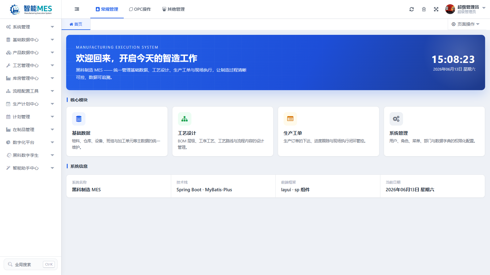

**界面区域说明**：

| 区域 | 说明 |
| :--- | :--- |
| 顶部栏 | 左侧 Logo「智能 MES」，中部一级分组切换（常规管理 / OPC 操作 / 其他管理），右侧刷新、全屏、用户头像与"退出登录"。 |
| 左侧导航 | 按"业务中心"组织的多级菜单树，底部提供"全局搜索"快速定位菜单。 |
| 内容区 | 以多标签页（Tab）方式打开各功能页，欢迎页展示"核心模块"快捷入口与系统信息。 |

主页"核心模块"区提供四个快捷入口：**基础数据、工艺设计、生产工单、系统管理**，并在"系统信息"区展示系统名称、技术栈、前端框架与当前日期。

## 3.3 通用操作规范

系统各功能页高度统一，掌握以下通用规范即可快速上手所有模块。

### 3.3.1 查询区

页面顶部为查询条件区，输入/选择条件后点击 **查询** 过滤数据，点击 **重置** 清空条件。

### 3.3.2 数据表格（spTable）

- 列表数据分页加载，底部为分页条（上一页/下一页、跳页、每页条数）。
- 表格右上角通常提供"列筛选、导出、打印"等工具按钮。
- 列表常见状态以彩色标签呈现：绿色=正常/已完成、橙色=待处理/草稿、红色=异常/删除、蓝色=进行中。

### 3.3.3 增删改（CRUD）

| 操作 | 入口 | 说明 |
| :--- | :--- | :--- |
| 新增 | 工具栏「新增/添加」 | 弹出表单弹窗，填写后保存 |
| 编辑 | 行内「编辑/修改」 | 带入当前行数据的表单弹窗 |
| 删除 | 行内「删除」 | 二次确认后**软删除**（置 `is_deleted=1`），不物理删除 |
| 禁用/启用 | 行内「禁用/启用」 | 状态在 正常(0) ↔ 禁用(2) 间切换 |

### 3.3.4 主从联动

部分模块为"主表—从表"布局（如班组—员工、库房—库位、加工单元—班组、编组—设备）：**先在上方选中一条主表记录，下方从表才会刷新对应明细**。从表标题处会有"（请先在上方选择一个 XX）"的提示。

### 3.3.5 选择弹窗

新增/编辑表单中常见"选择"按钮（如选择物料、选择 BOM、选择设备、选择员工），点击后弹出选择子页，勾选后回传到主表单。

<div style="page-break-after: always;"></div>

---

# 第 4 章 系统管理

系统管理面向平台管理员，负责菜单、用户、角色、部门等权限基础数据的维护，是整个系统的访问控制底座。

## 4.1 菜单管理

**路径**：常规管理 → 系统管理 → 菜单管理（`/admin/sys/menu/list-ui`）

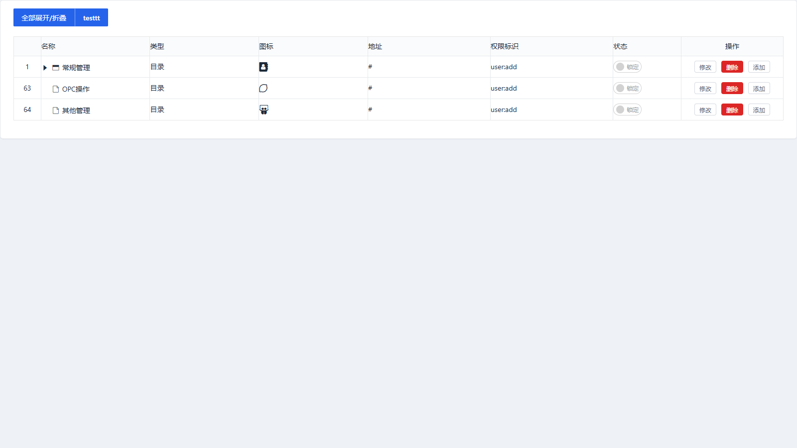

**功能用途**：以树形结构维护系统的全部导航菜单（目录/菜单/按钮），定义菜单名称、类型、图标、访问地址、权限标识与排序，是角色授权（授权菜单）的数据来源。

**界面说明**：以树表展示菜单层级，提供"全部展开/折叠"按钮；每行展示 名称、类型、图标、地址、权限标识、状态（锁定）及"修改/删除/添加（子菜单）"操作。

**操作流程**：

1. 点击行末 **添加** 为该节点新增子菜单；或点击顶部新增根级目录。
2. 在弹窗中填写：菜单名称、上级菜单、类型（目录/菜单/按钮）、路由地址、权限标识、图标、排序号。
3. 保存后菜单即出现在导航树（菜单数据存于 `sp_sys_menu` 表）。
4. 通过 **修改/删除** 维护已有菜单。

> 新增业务菜单通常通过 SQL 脚本 `INSERT IGNORE` 注册并授权给管理员角色（role code `888888`），以保证可重复部署。

## 4.2 用户管理

**路径**：常规管理 → 系统管理 → 用户管理（`/admin/sys/user/list-ui`）

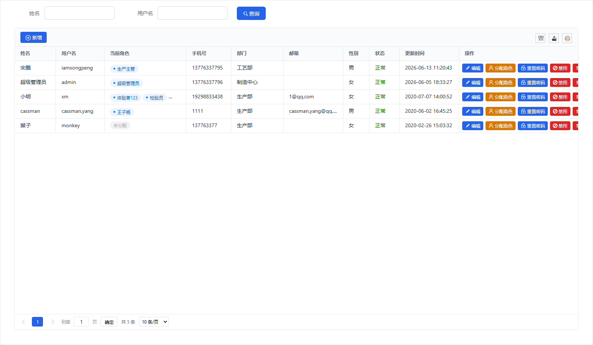

**功能用途**：维护系统登录账号，管理用户的基本信息、所属部门、性别、状态，并为用户**分配角色**、**重置密码**。

**字段说明**：

| 字段 | 说明 |
| :--- | :--- |
| 姓名 / 用户名 | 用户真实姓名与登录名 |
| 当前角色 | 用户已分配的角色（可多个，以标签展示，未分配显示"未分配"） |
| 手机号 / 邮箱 | 联系方式，邮箱亦可用于登录 |
| 部门 | 用户所属部门 |
| 状态 | 正常 / 禁用 |

**操作流程**：

1. **新增**：点击「新增」，填写姓名、用户名、密码、手机号、邮箱、部门、性别等并保存。
2. **分配角色**：点击行内「分配角色」，勾选一个或多个角色后确认，用户即获得对应菜单权限。
3. **重置密码**：点击「重置密码」将用户密码恢复为初始值。
4. **禁用/编辑/删除**：按需维护账号状态与信息。

## 4.3 角色管理

**路径**：常规管理 → 系统管理 → 角色管理（`/admin/sys/role/list-ui`）

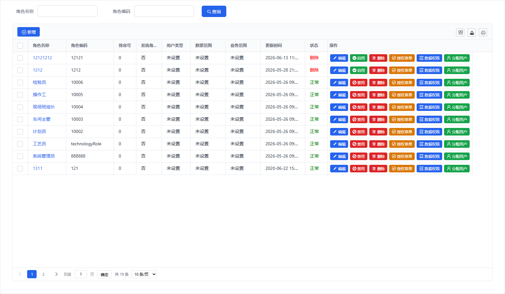

**功能用途**：定义系统角色并配置其**菜单权限**、**数据权限**与**用户归属**。角色是连接"用户"与"菜单/数据范围"的桥梁。

系统预置角色包括：系统管理员（编码 `888888`）、计划员、工艺员（`technologyRole`）、车间主管、现场班长、操作工、检验员等。

**行内操作**：

| 操作 | 说明 |
| :--- | :--- |
| 编辑 | 修改角色名称、编码、排序、备注 |
| 启用 / 禁用 | 切换角色可用状态 |
| 授权菜单 | 以树形勾选该角色可访问的菜单（数据写入 `sp_sys_role_menu`） |
| 数据权限 | 设置角色的数据范围（全部/本部门/本人等） |
| 分配用户 | 将用户批量加入/移出该角色 |

**操作流程（新建角色并授权）**：

1. 点击「新增」，填写角色名称、角色编码、排序号、备注，保存。
2. 在新角色行点击「授权菜单」，勾选业务菜单后确认。
3. 点击「分配用户」，把需要该权限的用户加入角色。
4. 用户重新登录后即按新权限显示菜单。

## 4.4 部门管理

**路径**：常规管理 → 系统管理 → 部门管理（`/admin/sys/department/list-ui`）

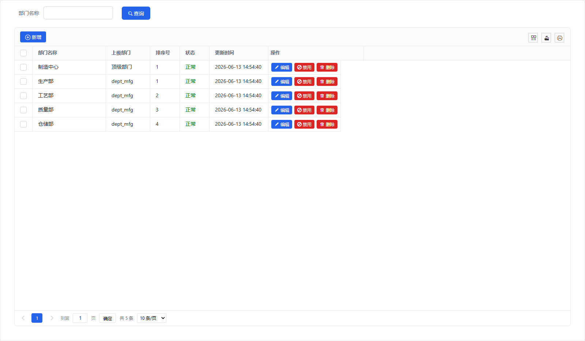

**功能用途**：以树形维护企业组织机构（部门/科室），部门用于用户归属与数据权限范围的划分。

**操作流程**：新增时选择上级部门构成层级；支持编辑名称、负责人、排序与删除。删除为软删除，存在下级或关联用户时需先处理子节点。

<div style="page-break-after: always;"></div>

---

# 第 5 章 基础数据中心

基础数据中心维护生产现场的"人、机、料、库"主数据，是工艺规划与生产派工的前置条件。

## 5.1 班组员工定义

**路径**：基础数据中心 → 班组员工定义（`/basedata/team/list-ui`）

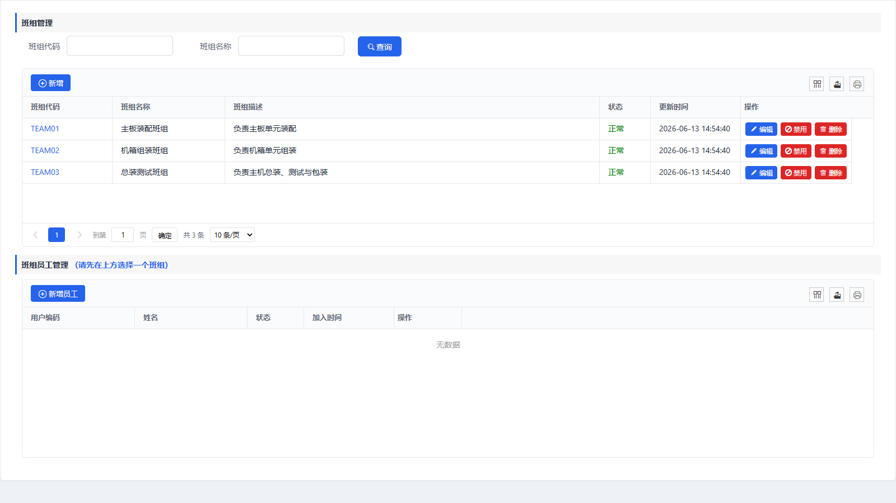

**功能用途**：以"班组（主表）—班组员工（从表）"两段式维护现场作业班组及其成员，为后续"加工单元绑定班组""员工作业派工"提供人员来源。

**界面说明**：上方为"班组管理"列表（班组代码、名称、描述、状态、更新时间），下方为"班组员工管理"，需**先选中一个班组**，才能在下方维护该班组的成员。

**操作流程**：

1. 在"班组管理"点击「新增」，填写班组代码（如 `TEAM01`）、班组名称（如"主板装配班组"）、描述并保存。
2. 点击选中刚创建的班组行。
3. 在下方"班组员工管理"点击「新增员工」，从系统用户中选择人员加入班组。
4. 成员的"用户编码、姓名、状态、加入时间"将显示在从表中。

## 5.2 编组设备定义

**路径**：基础数据中心 → 编组设备定义（`/basedata/equipment-group/list-ui`）

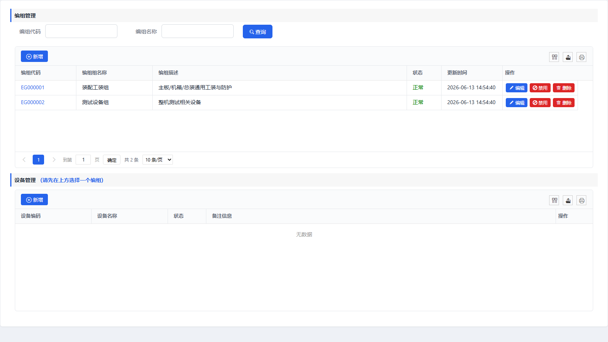

**功能用途**：将多台设备组织为"编组（设备组）"，以"编组（主表）—设备（从表）"维护。编组便于在工艺/派工时以"组"为单位引用设备资源（如"装配工装组""测试设备组"）。

**操作流程**：

1. 在"编组管理"点击「新增」，填写编组代码（如 `EG000001`）、编组名称、描述并保存。
2. 选中编组行，在下方"设备管理"点击「新增」将设备加入该编组。

## 5.3 加工单元定义

**路径**：基础数据中心 → 加工单元定义（`/basedata/processing-unit/list-ui`）

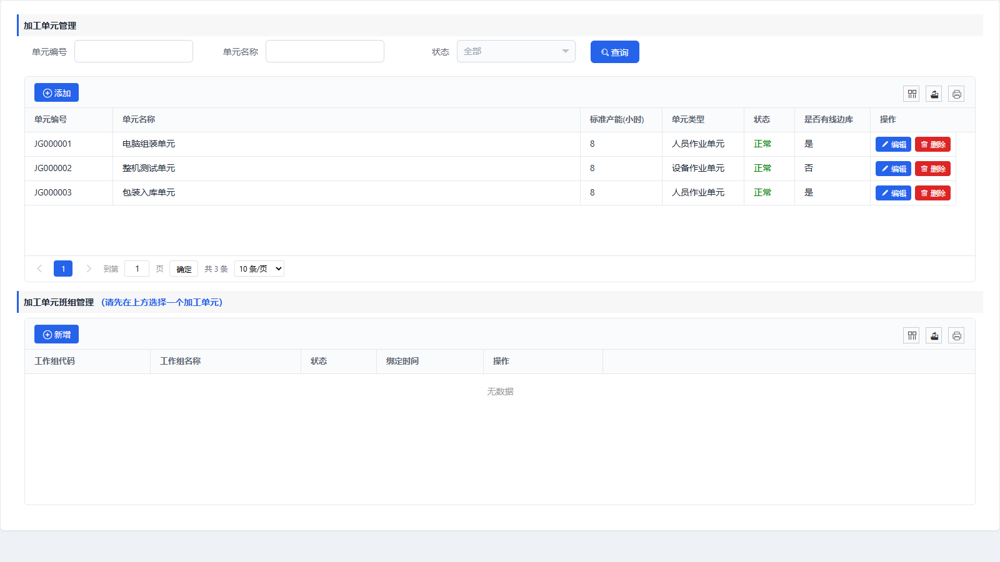

**功能用途**：定义生产的最小执行单位"加工单元"（如"电脑组装单元""整机测试单元""包装入库单元"），并为其绑定执行班组。加工单元是工序的承载者——工序信息定义中每道工序都归属于某个加工单元。

**字段说明**：

| 字段 | 说明 |
| :--- | :--- |
| 单元编号 / 名称 | 加工单元的唯一编码与名称 |
| 标准产能(小时) | 单元每小时标准产出能力，用于排产估算 |
| 单元类型 | 人员作业单元 / 设备作业单元 |
| 是否有线边库 | 该单元是否设置线边库 |

**操作流程**：

1. 「添加」加工单元，填写编号、名称、标准产能、单元类型、是否有线边库。
2. 选中加工单元行，在下方"加工单元班组管理"为其绑定执行班组。

## 5.4 设备管理

**路径**：基础数据中心 → 设备（`/basedata/equipment/list-ui`）

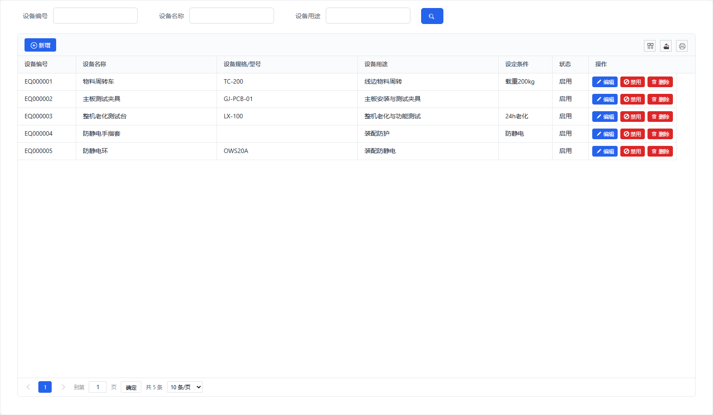

**功能用途**：维护车间设备/工装台账（设备编号、名称、状态、备注等），是"编组设备定义"与"设备作业派工"的设备来源。

**操作流程**：通过「新增/编辑/删除」维护设备主数据；设备可被加入编组、并在工艺-设备关联与设备派工中被引用。

## 5.5 库房库位定义

**路径**：基础数据中心 → 库房库位定义（`/basedata/warehouse/list-ui`）

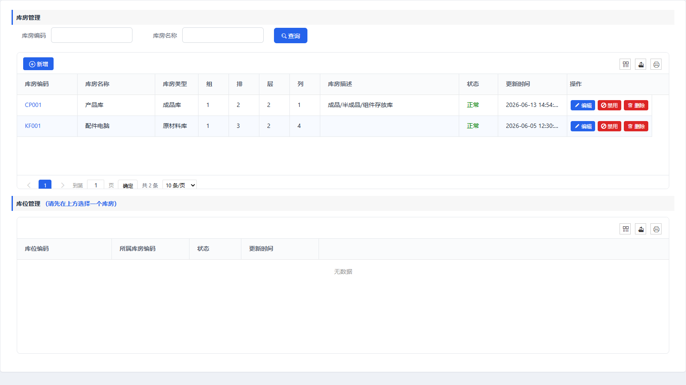

**功能用途**：以"库房（主表）—库位（从表）"维护仓储空间结构。库房按**组×排×层×列**四维定义容量，系统据此**自动批量生成库位编码**（如 `KF001-1-1-1-1`）。

**字段说明**：

| 字段 | 说明 |
| :--- | :--- |
| 库房编码 / 名称 | 库房唯一编码与名称（如 CP001 产品库、KF001 配件电脑） |
| 库房类型 | 成品库 / 原材料库 等 |
| 组 / 排 / 层 / 列 | 库房的库位维度，决定自动生成的库位数量与编码 |
| 状态 | 正常 / 禁用 |

**操作流程**：

1. 「新增」库房，填写编码、名称、类型，并设置 组/排/层/列。
2. 保存后系统按维度自动生成库位。
3. 选中库房行，下方"库位管理"展示该库房下的全部库位（库位编码、所属库房、状态）。

## 5.6 库存管理

**路径**：基础数据中心 → 库存管理（`/basedata/inventory/list-ui`）

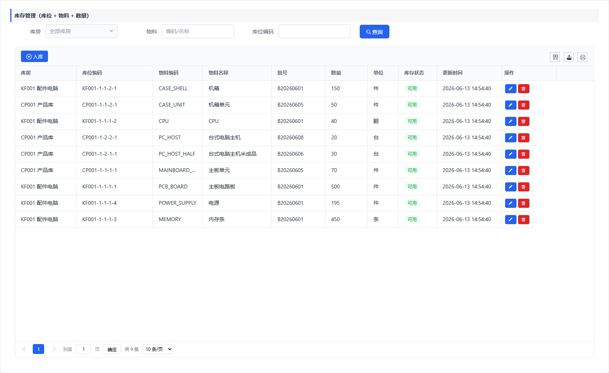

**功能用途**：以"库位 + 物料 + 数量"为粒度维护当前库存账，是出入库业务扣减/登账的对象。每条库存记录精确到 库房-库位-物料编码-批号-数量-单位-库存状态。

**操作流程**：

1. 可按库房、物料、库位编码查询库存。
2. 点击「入库」可手工录入一条库存（指定库房、库位、物料、批号、数量）。
3. 行内「编辑/删除」用于盘点调整。

> 实际生产中，库存的增减应主要由"库房管理中心"的入出库确认驱动，以保证有完整流水可追溯；此处的直接维护通常用于初始化与盘点。

<div style="page-break-after: always;"></div>

---

# 第 6 章 产品数据中心

产品数据中心维护"卖什么、由什么构成"的产品主数据：物料、零部件、BOM。

## 6.1 物料信息定义

**路径**：产品数据中心 → 物料信息定义（`/basedata/materile/list-ui`）

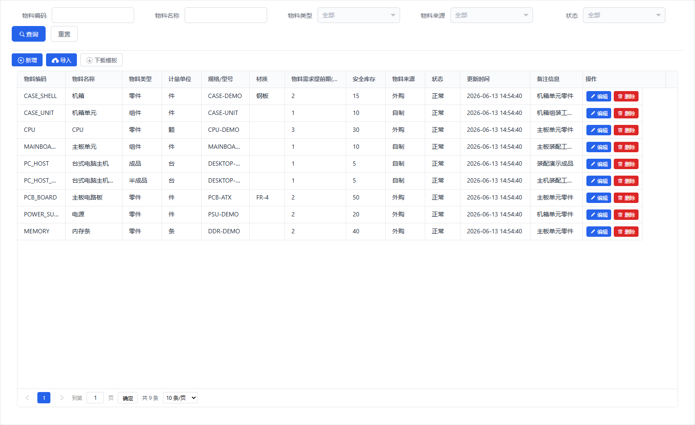

**功能用途**：维护系统全部物料的主数据，是 BOM、库存、采购/需求计算的基础。支持按物料类型、来源、状态筛选，并支持**批量导入/下载模板**。

**字段说明**：

| 字段 | 说明 |
| :--- | :--- |
| 物料编码 / 名称 | 物料唯一编码与名称（如 PC_HOST 台式电脑主机、CPU、MEMORY 内存条） |
| 物料类型 | 成品 / 半成品 / 组件 / 零件 |
| 计量单位 | 台 / 件 / 颗 / 条 等 |
| 规格/型号、材质 | 物料规格描述 |
| 物料需求提前期 | 采购/备料提前期（天），用于 MRP 需求日期推算 |
| 安全库存 | 触发补货的库存下限，参与净需求计算 |
| 物料来源 | 自制 / 外购 |
| 状态 | 正常 / 禁用 |

**操作流程**：

1. 「新增」单条物料，或点击「下载模板」填写后「导入」批量建料。
2. 通过查询区按编码/名称/类型/来源/状态过滤。
3. 行内「编辑/删除」维护物料信息。

## 6.2 零部件定义

**路径**：产品数据中心 → 零部件定义（`/technology/component/list-ui`）

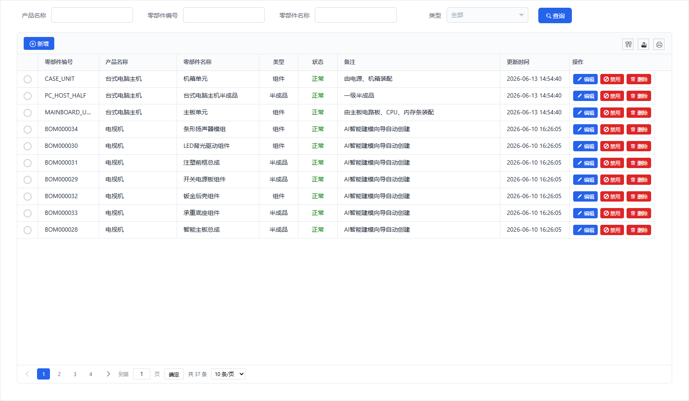

**功能用途**：定义构成产品的零部件（组件/半成品）及其与产品的归属关系。零部件是 BOM 行的组成元素，亦可由"AI 智能建模向导"自动批量创建。

**字段说明**：零部件编码、所属产品名称、零部件名称、类型（组件/半成品）、状态、备注。

**操作流程**：「新增」零部件并指定其所属产品与类型；可按产品名称、零部件编码/名称、类型查询。

## 6.3 产品 BOM 管理

**路径**：产品数据中心 → 产品 BOM 管理（`/technology/bom/list-ui`）

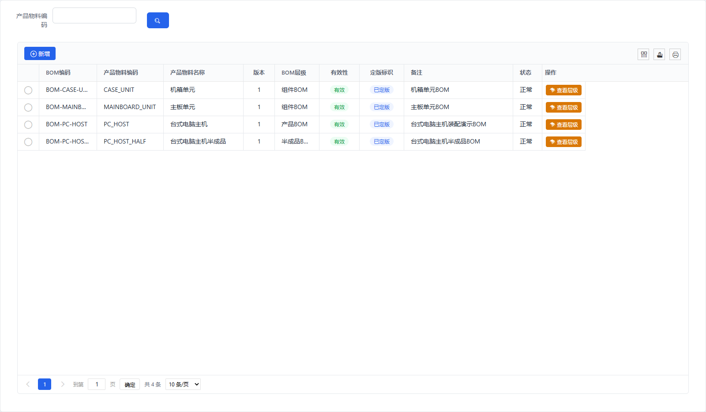

**功能用途**：维护产品的物料清单（Bill of Materials），系统支持**三层 BOM 层级结构**：

- **产品 BOM**：成品级清单（如 BOM-PC-HOST 台式电脑主机）；
- **半成品 BOM**：半成品级清单（如 BOM-PC-HOST-HALF 台式电脑主机半成品）；
- **组件 BOM**：组件级清单（如 BOM-MAINBOARD-UNIT 主板单元、BOM-CASE-UNIT 机箱单元）。

上层 BOM 行通过 `child_bom_id` 关联下层子 BOM，从而形成可逐层展开的 BOM 树。

**字段说明**：

| 字段 | 说明 |
| :--- | :--- |
| BOM 编码 / 产品物料编码 / 名称 | BOM 标识及其对应的产品物料 |
| 版本 | BOM 版本号 |
| BOM 层级 | 产品 BOM / 半成品 BOM / 组件 BOM |
| 有效性 | 是否有效 |
| 定版标识 | 是否已定版（已定版后用于工艺与 MRP） |
| 状态 | 正常 / 禁用 |

**操作流程**：

1. 「新增」BOM，选择对应产品物料、设置 BOM 层级与版本。
2. 进入 BOM 明细，逐行添加物料（零件/组件），组件行可关联其子 BOM。
3. 点击行内 **查看层级** 以树形查看 BOM 的完整多层结构。
4. BOM 经定版（已定版）后，方可作为工艺规划与物料需求计算的基准。

<div style="page-break-after: always;"></div>

---

# 第 7 章 工艺管理中心

工艺管理中心解决"怎么做"的问题：定义工序、编排工艺路线、绑定到 BOM 形成产品工艺规划、编制工艺内容，并提供查询。

## 7.1 工序信息定义

**路径**：工艺管理中心 → 工序信息定义（`/technology/oper/list-ui`）

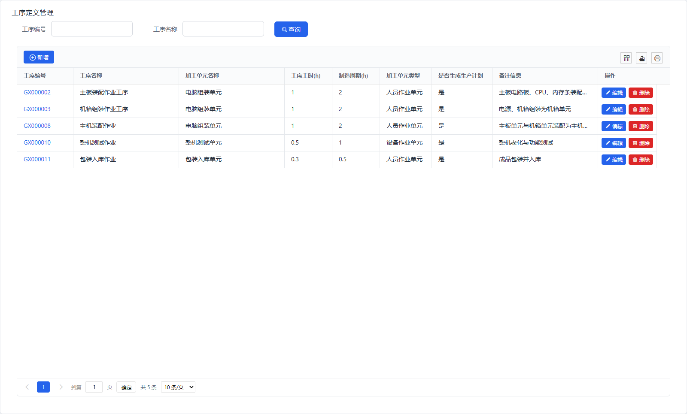

**功能用途**：定义标准工序库，每道工序归属于某个加工单元，并设定标准工时、制造周期、是否生成生产计划等属性，供工艺路线/工艺流程引用。

**字段说明**：

| 字段 | 说明 |
| :--- | :--- |
| 工序编号 / 名称 | 工序唯一编码与名称（如 GX000002 主板装配作业工序） |
| 加工单元名称 / 类型 | 工序所属加工单元及其类型（人员/设备作业单元） |
| 工序工时(h) | 单件标准作业工时 |
| 制造周期(h) | 工序制造周期 |
| 是否生成生产计划 | 该工序是否参与生产计划拆分 |

**操作流程**：「新增」工序，选择所属加工单元，填写工时、周期、是否生成生产计划等并保存。

## 7.2 工艺路线管理

**路径**：工艺管理中心 → 工艺路线管理（`/basedata/flow/process/list-ui`）

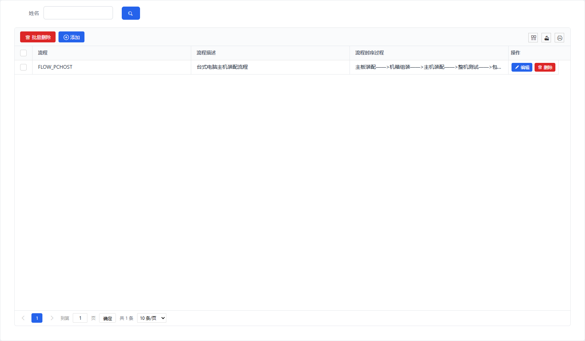

**功能用途**：定义产品的工艺路线（流程），即工序的时序串联（如：主板装配 → 机箱组装 → 主机装配 → 整机测试 → 包装入库）。一条流程描述了产品从开始到完工经过的工序顺序。

**操作流程**：「添加」流程，录入流程编码（如 `FLOW_PCHOST`）、流程描述，并编排工序的先后顺序；列表"流程时序过程"列直观展示工序串联关系。支持批量删除。

## 7.3 工艺流程管理

**路径**：工艺管理中心 → 工艺流程管理（`/technology/process-route/tree-ui`）

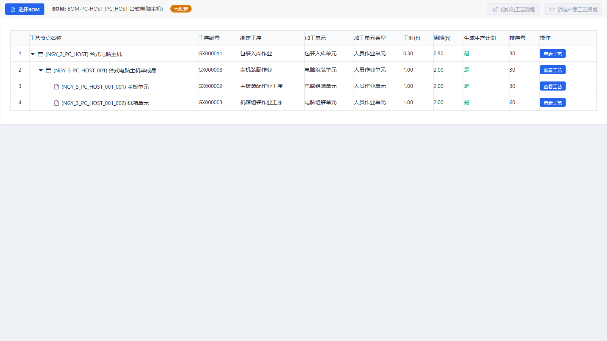

**功能用途**：将工艺路线**落到具体 BOM** 上，形成"产品工艺规划"。以 BOM 的层级树为骨架，为每个工艺节点绑定工序、加工单元、工时、周期、是否生成生产计划等，并支持**初始化**与**锁定定版**。

**界面说明**：顶部为工具条（选择 BOM、初始化工艺流程、锁定产品工艺规划），下方以树表展示该 BOM 的工艺节点层级。锁定后徽标显示"已锁定"，不可再编辑。

**字段说明**：工艺节点名称、工序编号、绑定工序、加工单元、加工单元类型、工时(h)、周期(h)、生成生产计划、排序号。

**操作流程**：

1. 点击 **选择BOM**，从已定版的 BOM 中选择一条（如 BOM-PC-HOST 台式电脑主机）。
2. 点击 **初始化工艺流程**（将按 BOM 结构生成工艺节点草稿，会覆盖未锁定的旧记录）。
3. 在树表中逐节点点击 **编辑工艺规划**，绑定工序、加工单元、工时等。
4. 各节点编制完成后，点击 **锁定产品工艺规划** 定版。
5. **锁定后**，该产品工艺及其工序不可再新增/编辑/删除，节点操作列变为"工艺内容编制 / 查看工艺"。

## 7.4 工艺内容编制

**路径**：工艺管理中心 → 工艺内容编制（`/technology/process-content/tree-ui`）

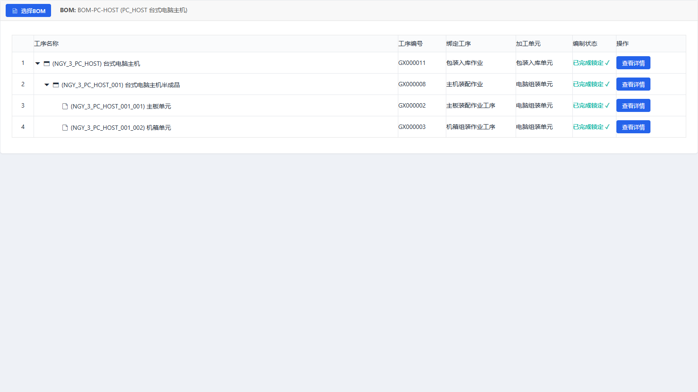

**功能用途**：在工艺规划锁定的基础上，为每个工艺节点编制详细的**工艺内容**（作业指导、参数、要点等），并标记编制状态（已完成）。是现场作业的执行依据。

**操作流程**：

1. 点击 **选择BOM**，载入该 BOM 的工艺节点树。
2. 对每个节点点击进入工艺内容编制向导（`wizard`），录入作业内容。
3. 节点"编制状态"显示"已完成 ✓"表示内容已编制完毕。

## 7.5 产品工艺查询

**路径**：工艺管理中心 → 产品工艺查询（`/technology/process-query/tree-ui`）

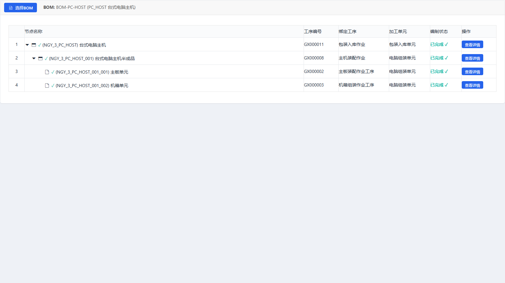

**功能用途**：以**只读**方式按 BOM 查看产品的完整工艺规划与工艺内容，供工艺评审、现场查阅、追溯使用，不提供编辑操作。

**操作流程**：选择 BOM → 展开工艺节点树 → 点击行内 **查看详情** 查看该节点的工序与工艺内容详情。

<div style="page-break-after: always;"></div>

---

# 第 8 章 生产计划中心

生产计划中心是 MES 的执行调度核心，覆盖从订单录入、MRP 运算、两级派工、物料配套到计划下发、工单生成的完整链路。

## 8.1 生产订单录入

**路径**：生产计划中心 → 生产订单录入（`/production-order/plan/list-ui`）

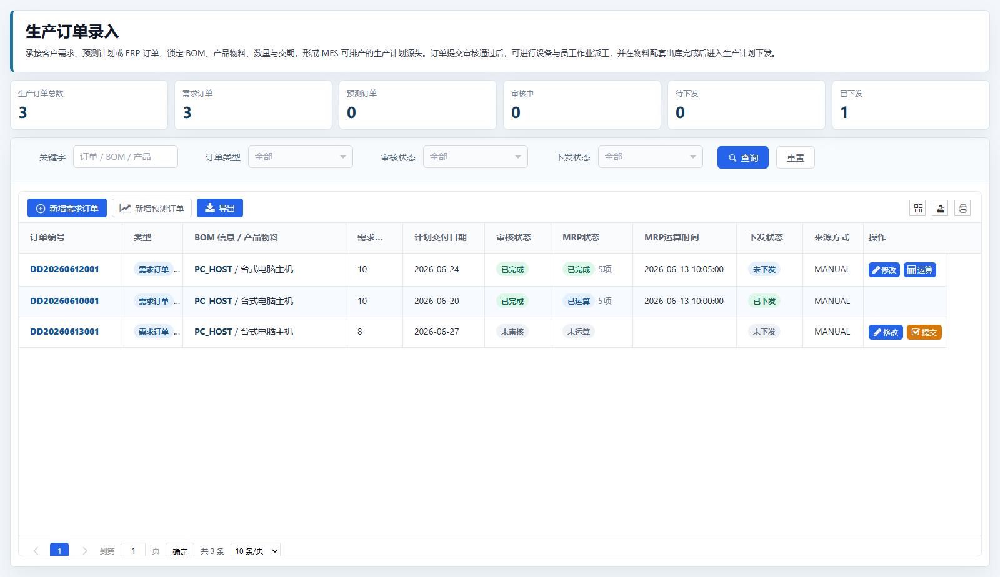

**功能用途**（页面副标题）：承接客户需求、预测计划或 ERP 订单，锁定 BOM、产品物料、数量与交期，形成 MES 可排产的生产计划源头。订单提交审核通过后，可进行设备与员工作业派工，并在物料配套出库完成后进入生产计划下发。

**界面说明**：顶部为 KPI 卡片（生产订单总数 / 需求订单 / 预测订单 / 审核中 / 待下发 / 已下发）；列表展示订单及其审核状态、MRP 状态、下发状态、来源方式。

**字段/状态说明**：

| 字段 | 说明 |
| :--- | :--- |
| 订单编号 | 系统生成（如 DD20260612001） |
| 类型 | 需求订单 / 预测订单 |
| BOM 信息 / 产品物料 | 关联的产品 BOM 与物料 |
| 需求数量 / 计划交付日期 | 订单数量与交期 |
| 审核状态 | 未审核 → 审核中 → 已完成 |
| MRP 状态 | 未运算 → 已运算 / 已完成（含明细项数） |
| 下发状态 | 未下发 / 已下发 |
| 来源方式 | MANUAL（手工）等 |

**操作流程**：

1. 点击 **新增需求订单**（或 **新增预测订单**），选择产品 BOM、填写数量、计划交付日期等并保存（初始为"未审核/未下发"）。
2. 在订单行点击 **提交**，进入审批流程（订单审批，见第 12 章）。
3. 审核通过后点击 **运算** 触发 MRP 物料需求运算，生成需求明细（MRP 状态变为已完成，记录运算时间）。
4. 订单达到"审核通过 + 派工完成 + 物料配套出库完成"后，进入"生产计划下发"。
5. 列表支持 **导出**；可按关键字、订单类型、审核状态、下发状态筛选。

## 8.2 设备作业派工

**路径**：生产计划中心 → 设备作业派工（`/production-order/equipment-dispatch/list-ui`）

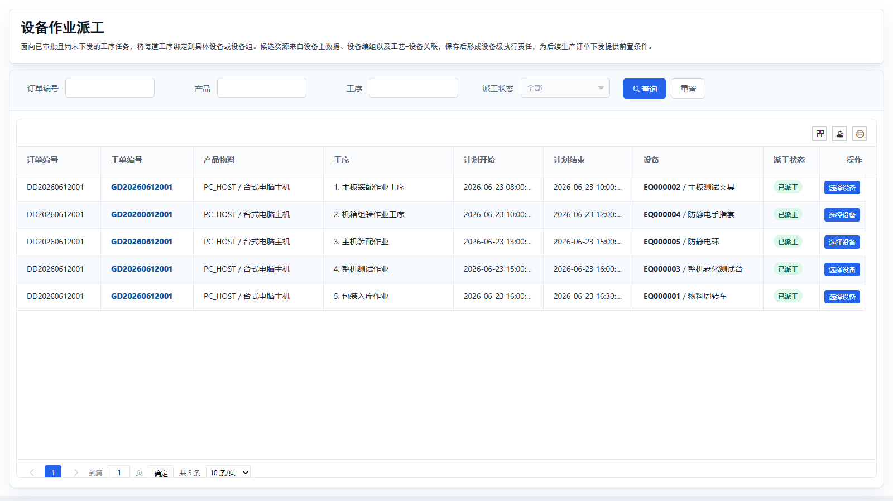

**功能用途**（页面副标题）：面向已审批且尚未下发的工序任务，将每道工序绑定到具体设备或设备组。候选资源来自设备主数据、设备编组以及工艺-设备关联，保存后形成设备级执行责任，为后续生产订单下发提供前置条件。

**界面说明**：列表按"订单—工单—工序"展开，每行展示计划开始/结束时间、当前绑定设备与派工状态（未派工/已派工）。

**操作流程**：

1. 按订单/产品/工序筛选待派工的工序任务。
2. 在工序行点击 **选择设备**，从候选设备/设备组中选择并确认。
3. 该工序"派工状态"变为"已派工"。所有工序设备派工完成是计划下发的前置条件之一。

## 8.3 员工作业派工

**路径**：生产计划中心 → 员工作业派工（`/production-order/employee-dispatch/list-ui`）

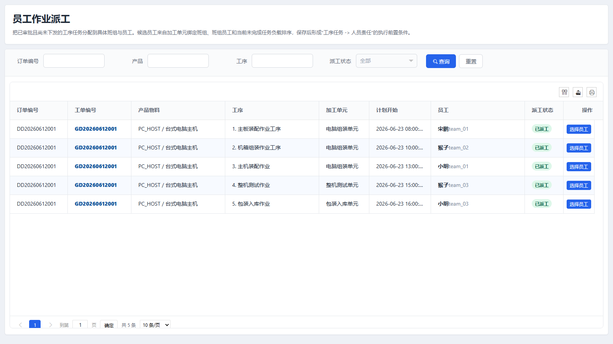

**功能用途**（页面副标题）：把已审批且尚未下发的工序任务分配到具体班组与员工。候选员工来自加工单元绑定班组、班组员工和当前未完成任务负载排序，保存后形成"工序任务 → 人员责任"的执行前置条件。

**特色能力**：候选员工按"当前未完成任务负载"排序，辅助实现**负载均衡**派工（如演示数据中工序被均衡分配给 team_01/02/03 的不同员工）。

**操作流程**：在工序行点击 **选择员工**，系统按负载排序给出候选人员，选择后确认；工序"派工状态"变为"已派工"。

## 8.4 物料需求计划（明细）

**路径**：生产计划中心 → 物料需求计划(明细)（`/production-order/material-plan/list-ui`）

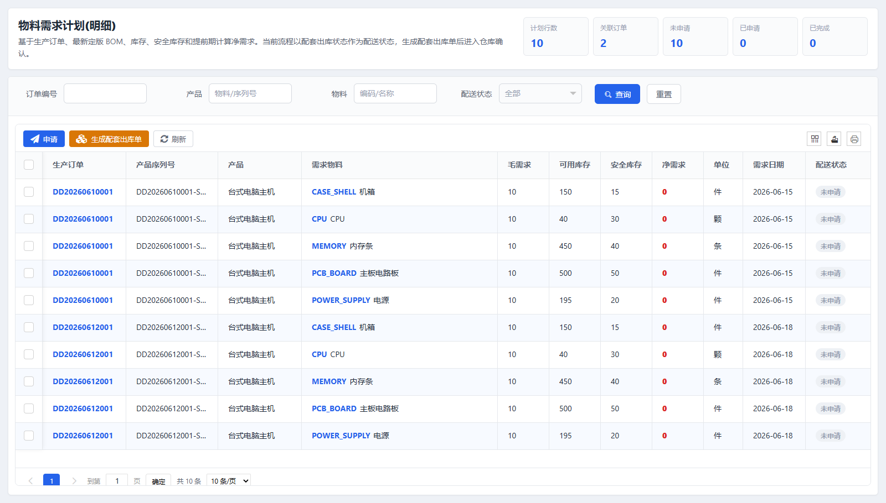

**功能用途**（页面副标题）：基于生产订单、最新定版 BOM、库存、安全库存和提前期计算净需求。当前流程以配套出库状态作为配送状态，生成配套出库单后进入仓库确认。

**界面说明**：顶部 KPI（计划行数 / 关联订单 / 未申请 / 已申请 / 已完成）；明细列表逐行展示需求物料的毛需求、可用库存、安全库存、净需求、单位、需求日期与配送状态。

**字段说明**：

| 字段 | 说明 |
| :--- | :--- |
| 生产订单 / 产品序列号 / 产品 | 需求来源订单与产品 |
| 需求物料 | 展开后的物料（如 CASE_SHELL 机箱、CPU、MEMORY 内存条、PCB_BOARD 主板电路板、POWER_SUPPLY 电源） |
| 毛需求 | 按 BOM 展开的总需求量 |
| 可用库存 / 安全库存 | 当前可用库存与安全库存线 |
| 净需求 | 实际需要补充的数量（毛需求 − 可用 + 安全库存等规则计算） |
| 需求日期 | 按提前期推算的需求时间 |
| 配送状态 | 未申请 → 已申请 → 已完成 |

**操作流程**：

1. 勾选需要备料的需求行，点击 **申请**（生成入库/采购申请意图）。
2. 点击 **生成配套出库单**，将车间所需物料从库房配套出库（进入仓库确认）。
3. 点击 **刷新** 同步最新配送状态。

## 8.5 物料需求计划（查询）

**路径**：生产计划中心 → 物料需求计划(查询)（`/production-order/material-plan/week-ui`）

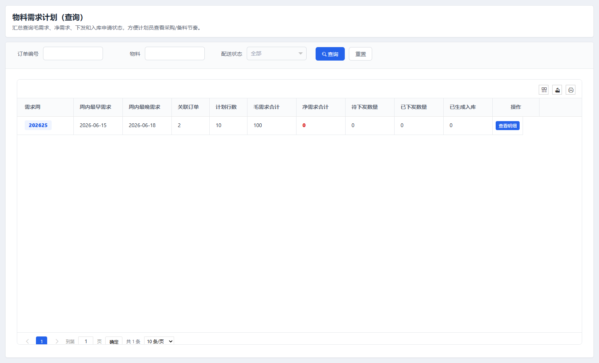

**功能用途**（页面副标题）：汇总查询毛需求、净需求、下发和入库申请状态，方便计划员查看采购/备料节奏。以"需求周"维度汇总（如 202625 周），展示周内最早/最晚需求、关联订单、计划行数、毛需求合计、净需求合计、待下发/已下发数量等。

**操作流程**：按订单/物料/配送状态查询；点击行内 **查看明细** 下钻到该周的物料需求明细。

## 8.6 入库申请单

**路径**：生产计划中心 → 入库申请单（`/production-order/material-plan/inbound-request/list-ui`）

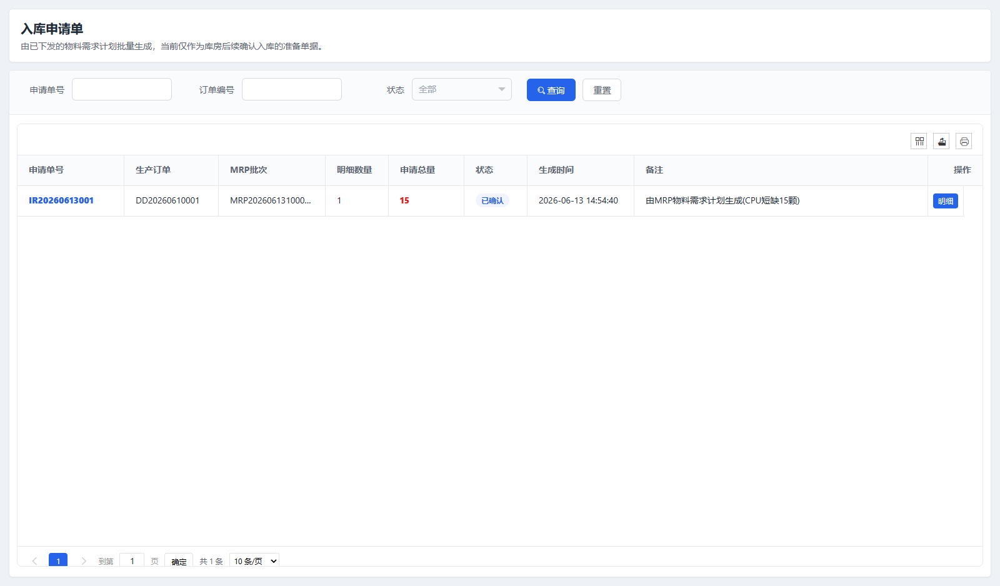

**功能用途**：汇总由物料需求计划产生的入库（采购/备料到货）申请单据，供计划与仓储跟踪到货与入库进度，是"计划入库确认"的来源单据。

**操作流程**：查询入库申请单并跟踪其状态；到货后由库房管理中心"计划入库确认"完成登账。

## 8.7 生产计划下发

**路径**：生产计划中心 → 生产计划下发（`/production-order/dispatch/list-ui`）

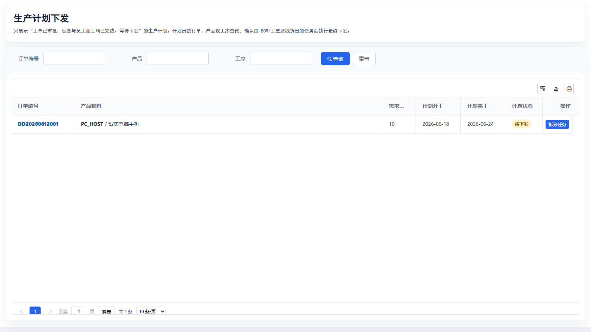

**功能用途**（页面副标题）：只展示"工单已审批、设备与员工派工均已完成、等待下发"的生产计划。计划员按订单、产品或工序查询，确认由 BOM/工艺路线拆出的任务后执行最终下发。

**操作流程**：

1. 在列表中找到"待下发"的生产计划行。
2. 点击 **拆分任务**，确认由 BOM/工艺路线拆出的工序任务。
3. 执行下发，订单"下发状态"变为已下发，并据此生成生产工单（见 8.8 / 9.1）。

## 8.8 生产工单查询

**路径**：生产计划中心 → 生产工单查询（`/production-order/work-order/list-ui`）

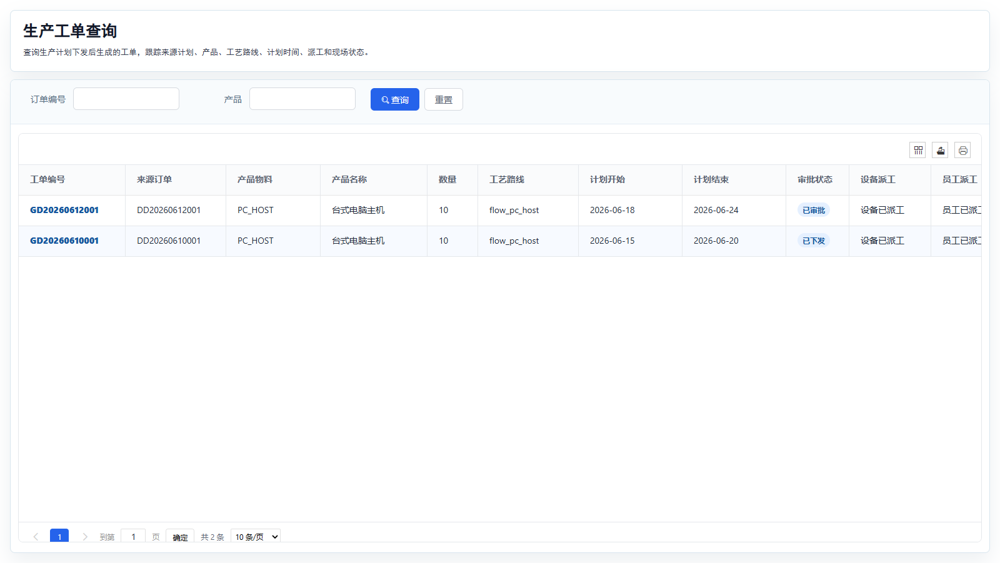

**功能用途**（页面副标题）：查询生产计划下发后生成的工单，跟踪来源计划、产品、工艺路线、计划时间、派工和现场状态。

**字段说明**：工单编号（如 GD20260612001）、来源订单、产品物料/名称、数量、工艺路线、计划开始/结束、审批状态、设备派工、员工派工状态等。

**操作流程**：按订单编号/产品查询工单，查看其完整执行属性，用于现场进度跟踪与追溯。

<div style="page-break-after: always;"></div>

---

# 第 9 章 计划管理

计划管理从"工单"视角集中管理生产工单的全生命周期（审批 → 动工 → 完工 → 交付），并归档已交付历史。

## 9.1 工单管理

**路径**：计划管理 → 工单管理（`/order/release/list-ui`）

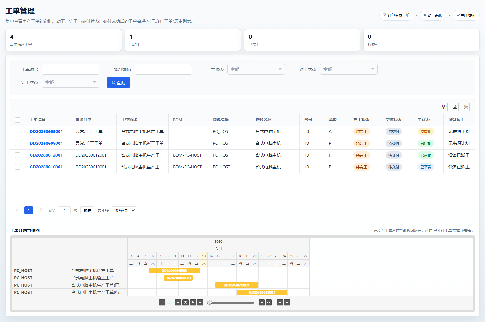

**功能用途**（页面副标题）：集中查看生产工单的审批、动工、完工与交付状态；交付成功后的工单会进入"已交付工单"历史列表。页面提供"订单生成工单 → 动工采集 → 完工交付"的操作引导，并以**甘特图**直观展示各工单的计划时间分布。

**界面说明**：顶部 KPI（当前筛选工单 / 已动工 / 已完工 / 待交付）；中部为工单列表（工单编号、来源订单、工单描述、BOM、物料、数量、类型、完工状态、交付状态、主状态、设备派工等），底部为"工单计划甘特图"。

**工单类型/状态说明**：

| 维度 | 取值 |
| :--- | :--- |
| 类型 | P（计划/生产工单）、A（试产）、F（返工/返修）等 |
| 主状态 | 待审批 / 已审批 / 已下发 |
| 完工状态 | 待完工 / 已完工 |
| 交付状态 | 待交付 / 已交付 |

**操作流程**：

1. 通过查询区按工单编号、物料编码、主/动工/完工状态筛选。
2. 对工单执行 **动工采集**（现场过站采集，见第 11 章）与 **完工交付**。
3. 交付成功的工单从本视图移除，进入"已交付工单"。

## 9.2 已交付工单

**路径**：计划管理 → 已交付工单（`/order/delivered/list-ui`）

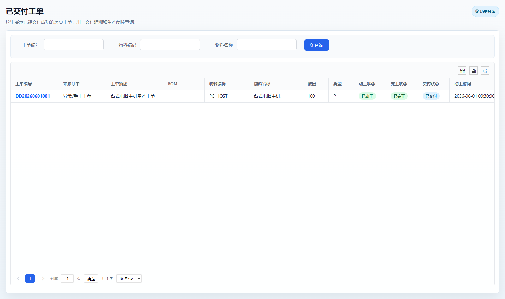

**功能用途**（页面副标题）：展示已经交付成功的历史工单，用于交付追溯和生产闭环查询。本页为**历史只读**视图。

**操作流程**：按工单编号、物料编码/名称查询历史工单，查看其动工状态、完工状态、交付状态与时间，实现生产闭环追溯。

<div style="page-break-after: always;"></div>

---

# 第 10 章 库房管理中心

库房管理中心采用"**申请—确认**"两段式作业：申请端只登记意图，确认端负责最终登账。每一次入库/出库确认都会写库存并沉淀为不可跳过的库存流水。

## 10.1 手工入库申请 / 确认

### 手工入库申请

**路径**：库房管理中心 → 手工入库申请（`/warehouse/manual-inbound/apply/list-ui`）

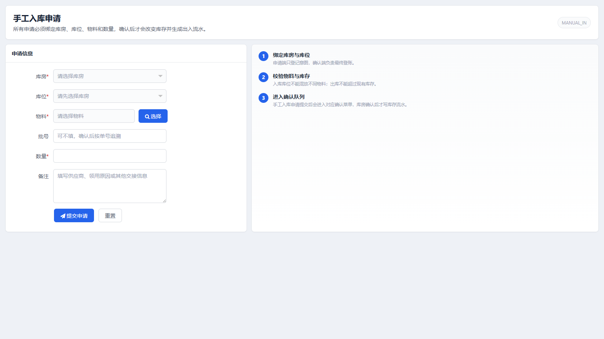

**功能用途**（页面副标题）：所有申请必须绑定库房、库位、物料和数量，确认后才会改变库存并生成出入流水。页面右侧以三步要点说明业务规则：① 绑定库房与库位（申请端只登记意图，确认端负责最终登账）；② 校验物料与库存（入库库位不能混放不同物料；出库不能超过现有库存）；③ 进入确认队列（提交后进入对应确认菜单，库房确认后才写库存流水）。

**操作流程**：

1. 选择 **库房** → **库位**（库位随库房联动）。
2. 点击 **选择** 选定 **物料**，填写 **批号**（可选，确认后按单号追溯）、**数量**（必填）、备注（供应商/领用原因等）。
3. 点击 **提交申请**，单据进入"手工入库确认"队列。

### 手工入库确认

**路径**：库房管理中心 → 手工入库确认（`/warehouse/manual-inbound/confirm/list-ui`）

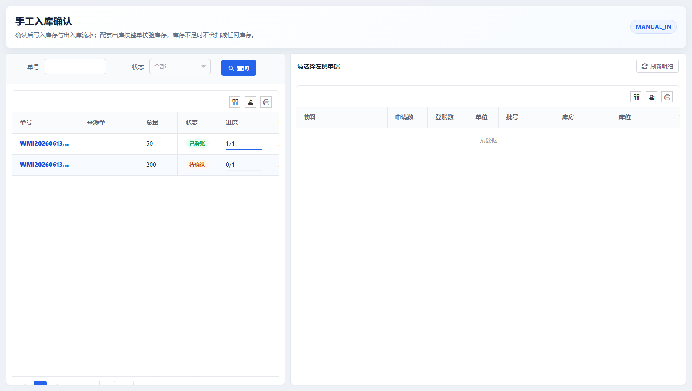

**功能用途**（页面副标题）：确认后写入库存与出入库流水；配套出库按整单校验库存，库存不足时不会扣减任何库存。

**界面说明**：左侧为待确认单据列表（单号、总量、状态[待确认/已登账]、进度），右侧为所选单据的物料明细（物料、申请数、登账数、单位、批号、库房、库位）。

**操作流程**：选中左侧单据 → 核对右侧明细 → 执行确认 → 库存登账并生成入库流水，单据状态变为"已登账"，进度更新（如 1/1）。

## 10.2 计划入库确认

**路径**：库房管理中心 → 计划入库确认（`/warehouse/plan-inbound/confirm/list-ui`）

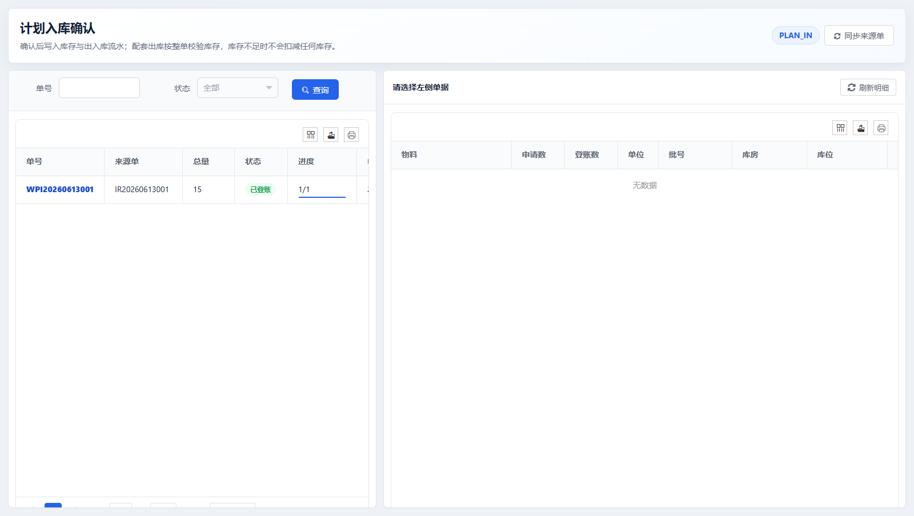

**功能用途**：对由"入库申请单（生产计划中心）"产生的计划入库单据进行到货确认与登账，是采购/备料到货入库的确认入口。操作方式与手工入库确认一致（选单 → 核对明细 → 确认登账）。

## 10.3 手工出库申请 / 确认

### 手工出库申请

**路径**：库房管理中心 → 手工出库申请（`/warehouse/manual-outbound/apply/list-ui`）


**功能用途**：登记手工出库意图（领料、退料、报废等），绑定库房、库位、物料、数量后提交，进入"手工出库确认"队列。**出库不能超过现有库存。**

### 手工出库确认

**路径**：库房管理中心 → 手工出库确认（`/warehouse/manual-outbound/confirm/list-ui`）

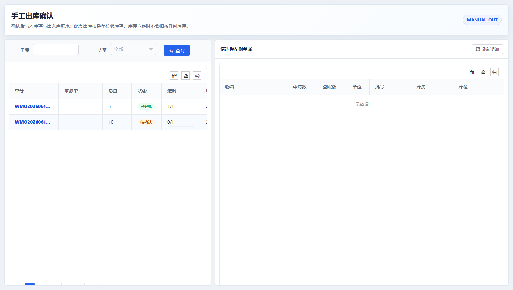

**功能用途**：确认手工出库申请，扣减库存并生成出库流水。选单 → 核对明细 → 确认登账。

## 10.4 配套出库确认

**路径**：库房管理中心 → 配套出库确认（`/warehouse/kitting-outbound/confirm/list-ui`）

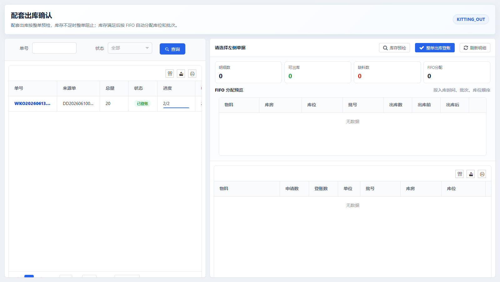

**功能用途**：对由"物料需求计划"生成的**配套出库单**进行确认。配套出库**按整单校验库存**，整单物料均满足时方可出库，库存不足时不扣减任何库存，从而保证齐套配送。确认后扣减库存、生成配套出库流水，并回写物料需求计划的配送状态。

## 10.5 库存明细查询

**路径**：库房管理中心 → 库存明细查询（`/warehouse/inventory/detail/list-ui`）

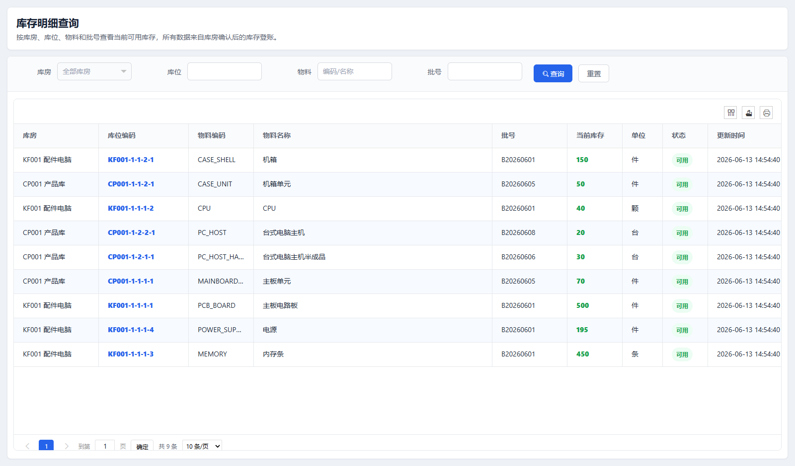

**功能用途**（页面副标题）：按库房、库位、物料和批号查看当前可用库存，所有数据来自库房确认后的库存登账。

**字段说明**：库房、库位编码、物料编码/名称、批号、当前库存、单位、状态（可用）、更新时间。

**操作流程**：按库房/库位/物料/批号组合查询，实时掌握各库位的可用库存。

## 10.6 出入库流水查询

**路径**：库房管理中心 → 出入库流水查询（`/warehouse/transaction/list-ui`）

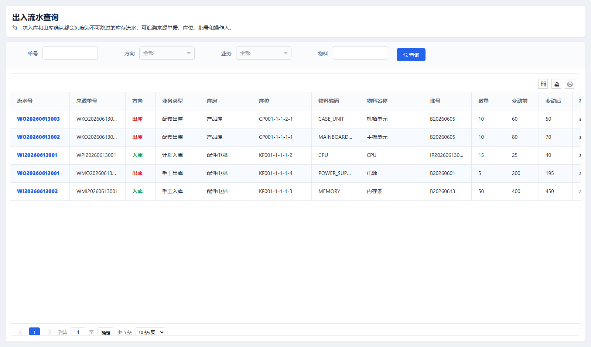

**功能用途**（页面副标题）：每一次入库和出库确认都会沉淀为不可跳过的库存流水，可追溯来源单据、库位、批号和操作人。

**字段说明**：

| 字段 | 说明 |
| :--- | :--- |
| 流水号 | 入库 WI* / 出库 WO* |
| 来源单号 | 触发本次流水的业务单据号 |
| 方向 | 入库 / 出库 |
| 业务类型 | 手工入库 / 计划入库 / 手工出库 / 配套出库 |
| 库房 / 库位 / 物料 / 批号 | 流水对应的仓储与物料定位 |
| 数量 / 变动前 / 变动后 | 本次变动量及库存前后值 |

**操作流程**：按单号、方向、业务、物料查询，逐笔审计库存变动，实现全程可追溯。

<div style="page-break-after: always;"></div>

---

# 第 11 章 在制品管理

## 11.1 SN 通用过程采集

**路径**：在制品管理 → SN 通用过程采集（`/wip/sn-process/list-ui`）

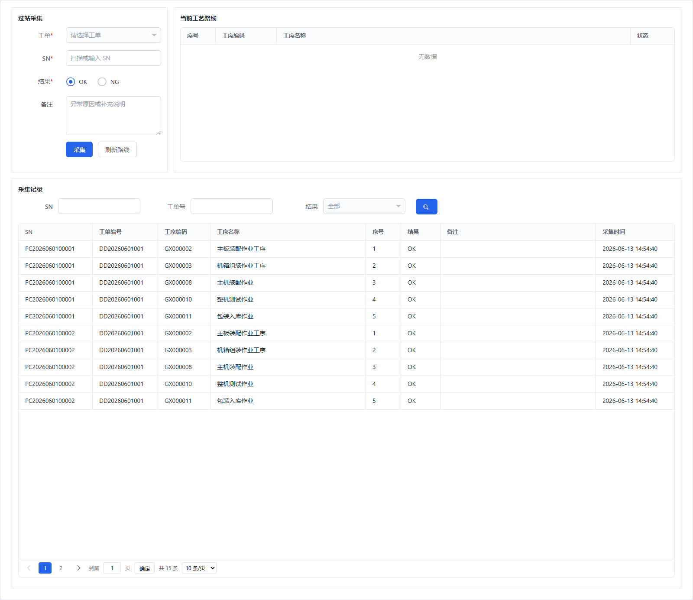

**功能用途**：面向现场，以**产品序列号（SN）**为载体进行**过站采集**——记录每个 SN 在每道工序的 OK/NG 结果，形成单件追溯链。是工序合格率、过程质量统计的数据来源。

**界面说明**：左上"过站采集"录入区（选择工单、扫描/输入 SN、选择结果 OK/NG、备注、采集/刷新路线）；右上"当前工艺路线"展示该工单的工序顺序及状态；下方"采集记录"列表展示历史采集（SN、工单号、工序编码/名称、序号、结果、备注、采集时间）。

**操作流程**：

1. 选择 **工单**，系统在右侧加载该工单的工艺路线。
2. 在 **SN** 框扫描或录入产品序列号。
3. 选择 **结果**（OK/NG），NG 时在备注中填写异常原因。
4. 点击 **采集**，记录该 SN 在当前工序的过站结果；产品依工艺路线逐站采集直至完工。
5. 下方"采集记录"可按 SN、工单号、结果筛选查询。

<div style="page-break-after: always;"></div>

---

# 第 12 章 流程配置工具

流程配置工具是一套轻量级**审批工作流引擎**，采用"分类 → 模型 → 定义 → 实例 → 任务"的分层结构，将审批能力以业务类型（如订单审批 ORDER_APPROVAL、工单变更 WORK_ORDER_CHANGE）挂接到具体业务单据上。

## 12.1 流程办理

**路径**：流程配置工具 → 流程办理（`/workflow/handle/list-ui`）

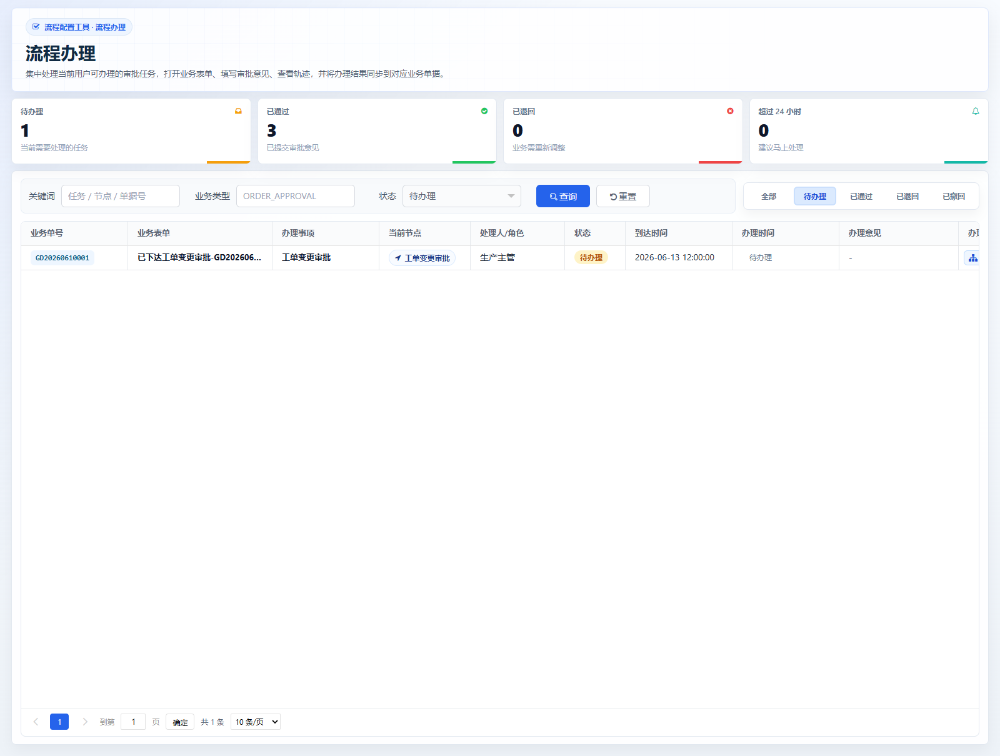

**功能用途**（页面副标题）：集中处理当前用户可办理的审批任务，打开业务表单、填写审批意见、查看轨迹，并将办理结果同步到对应业务单据。

**界面说明**：顶部 KPI（待办 / 已通过 / 已退回 / 超过 24 小时）；右上提供 全部/待办理/已通过/已退回/已撤回 快速筛选；列表展示业务单号、业务表单、办理事项、当前节点、处理人/角色、状态、到达时间等。

**操作流程**：

1. 默认展示"待办理"任务。点击任务行打开业务表单。
2. 审阅后填写审批意见，选择 **通过** 或 **退回**。
3. 通过则流转至下一节点或办结；退回则业务需重新调整。
4. 办理结果实时回写业务单据状态（如订单"审核状态"、工单"审批状态"）。

## 12.2 流程分类管理

**路径**：流程配置工具 → 流程管控 → 流程分类管理（`/workflow/category/list-ui`）

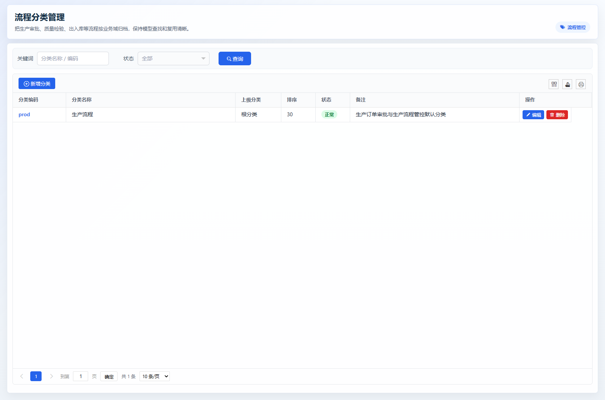

**功能用途**：维护流程的业务分类（按业务类型组织流程），是流程模型/定义的归类维度。提供新增、编辑、删除分类。

## 12.3 流程模型设计

**路径**：流程配置工具 → 流程管控 → 流程模型设计（`/workflow/model/list-ui`）

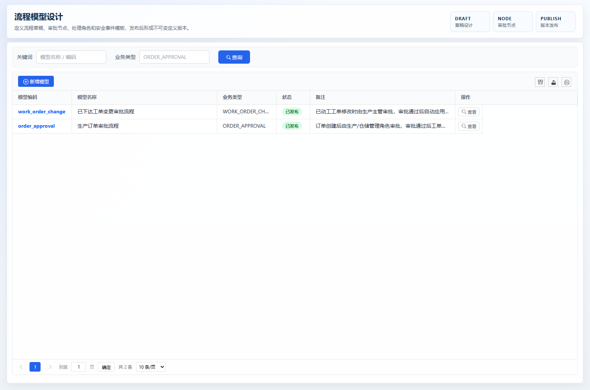

**功能用途**（页面副标题）：定义流程草稿、审批节点、处理角色和安全事件模板，发布后形成不可变定义版本。页面右上以 DRAFT（草稿设计）→ NODE（审批节点）→ PUBLISH（版本发布）说明设计阶段。

**字段说明**：模型编码、模型名称、业务类型（如 ORDER_APPROVAL 生产订单审批流程、WORK_ORDER_CHANGE 工单变更审批流程）、状态（已发布）、备注。

**操作流程**：

1. 点击 **新增模型**，填写模型编码、名称、业务类型与备注（草稿态）。
2. 设计审批节点（节点名称、处理角色、流转规则）。
3. 发布模型 → 生成不可变的"流程定义"版本。

## 12.4 流程定义管理

**路径**：流程配置工具 → 流程管控 → 流程定义管理（`/workflow/definition/list-ui`）

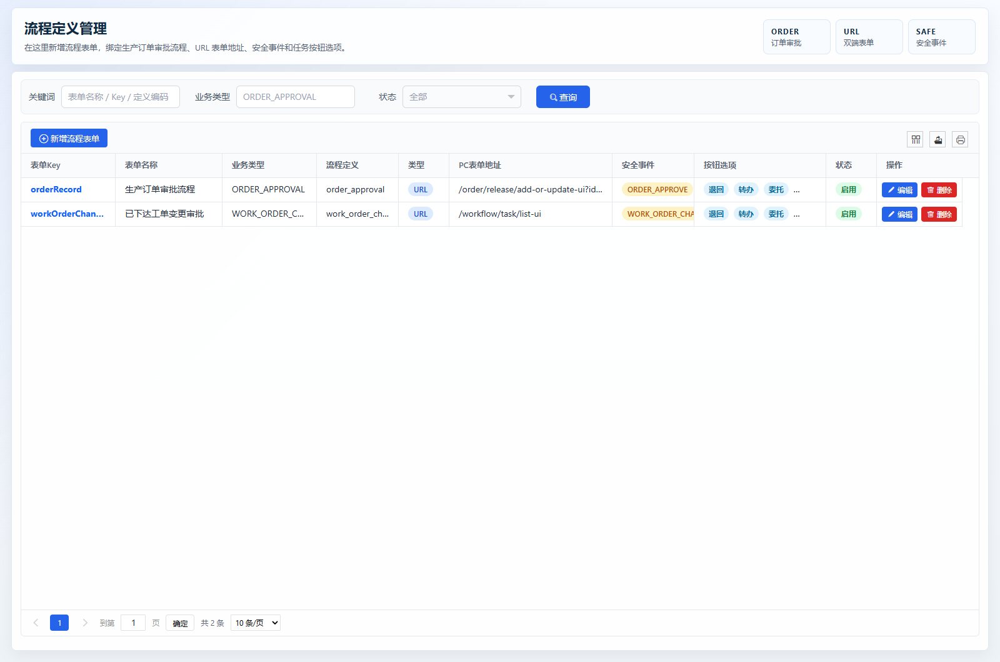

**功能用途**：管理由模型发布产生的流程定义版本。流程定义是流程实例运行所依据的"已发布、不可变"蓝本，可查看版本与节点配置。

## 12.5 流程实例管理

**路径**：流程配置工具 → 流程管控 → 流程实例管理（`/workflow/instance/list-ui`）

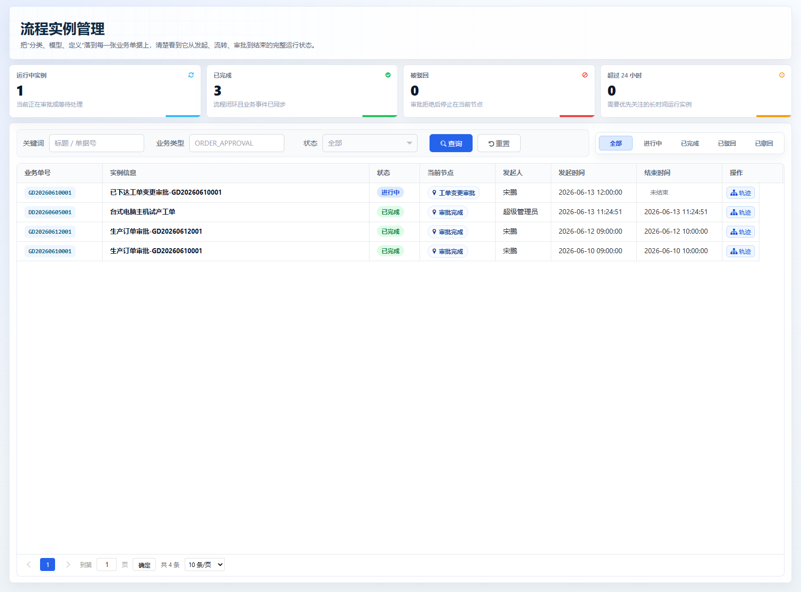

**功能用途**（页面副标题）：把"分类、模型、定义"落到每一张业务单据上，清楚看到它从发起、流转、审批到结束的完整运行状态。

**界面说明**：顶部 KPI（运行中实例 / 已完成 / 被驳回 / 超过 24 小时）；列表展示业务单号、实例信息、状态（进行中/已完成）、当前节点、发起人、发起/结束时间，并提供 **轨迹** 查看流转全过程。

**操作流程**：按业务类型/状态筛选实例，点击 **轨迹** 查看该业务单据的审批流转明细。

## 12.6 流程任务管理

**路径**：流程配置工具 → 流程管控 → 流程任务管理（`/workflow/task/list-ui`）

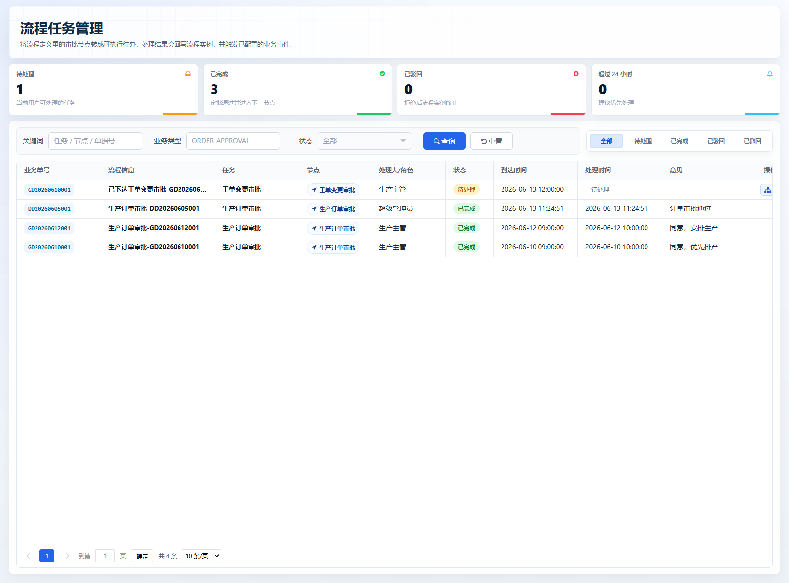

**功能用途**：从"任务"维度管理流程中产生的全部审批任务（含待办、已办），供管理员监控任务分布、处理人与时效，是"流程办理"的全局管理视图。

<div style="page-break-after: always;"></div>

---

# 第 13 章 数字化平台

数字化平台提供面向管理层的可视化大屏，将分散的生产数据汇聚为直观的图表看板。

## 13.1 智慧大屏

**路径**：数字化平台 → 智慧大屏（`/digitization/plan/plan-ui`）

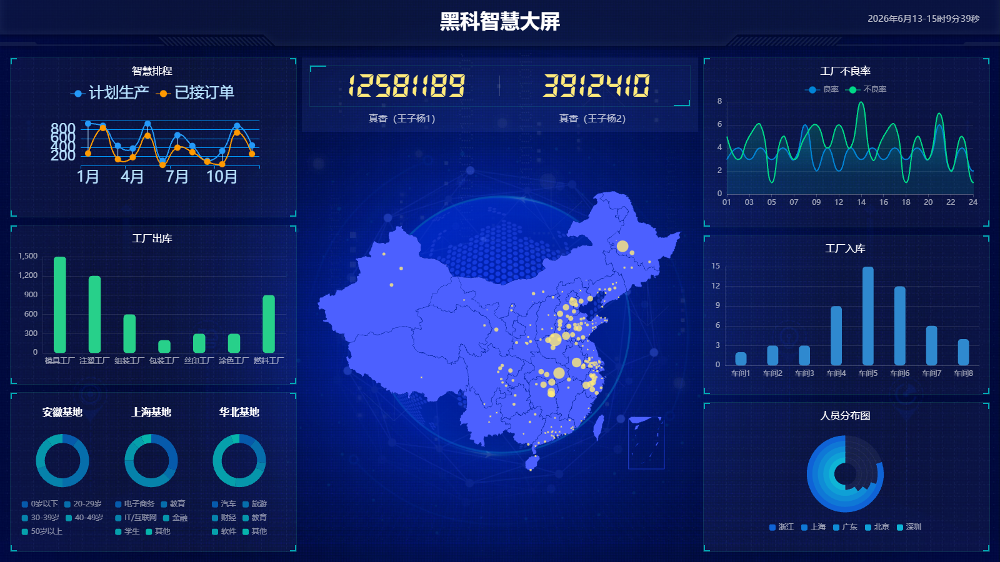

**功能用途**：以"黑科智慧大屏"形式综合展示计划/订单趋势、厂区分布地图、各厂出入库、人员/任务分布等多维度可视化指标，适合指挥中心/展厅大屏投放。

**界面说明**：中央为中国地图分布，四周环绕折线图、柱状图、环形占比图与关键数字看板（计划生产订单、已接订单等），整体为深色科技风。

## 13.2 智能制造数据中心

**路径**：数字化平台 → 智能制造数据中心（`/digitization/dashboard/screen-ui`）

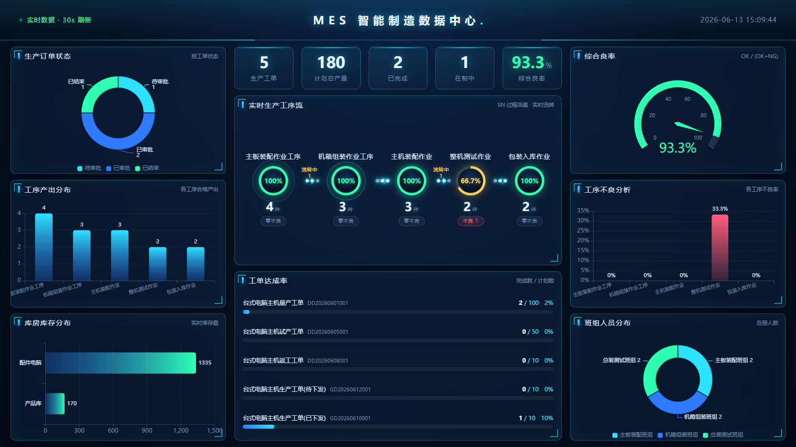

**功能用途**：基于系统**真实业务数据**构建的智能制造数据中心大屏，聚合生产工单、报工合格率、工序产出、计划达成、库存与负载等核心指标，用于实时掌握工厂运行态势。

**界面说明**：顶部为关键数字（产量、订单、合格率等）；中部为"生产订单工单流转"环节流（已下达 → … 各阶段计数）、工序分析仪表盘与各厂趋势；底部为工序/库存/负载占比图。基于 ECharts 渲染。

<div style="page-break-after: always;"></div>

---

# 第 14 章 黑科数字孪生

## 14.1 数字仿真 3D 仓库

**路径**：黑科数字孪生 → 数字仿真 3D 仓库（`/digital/simulation/list-ui`）

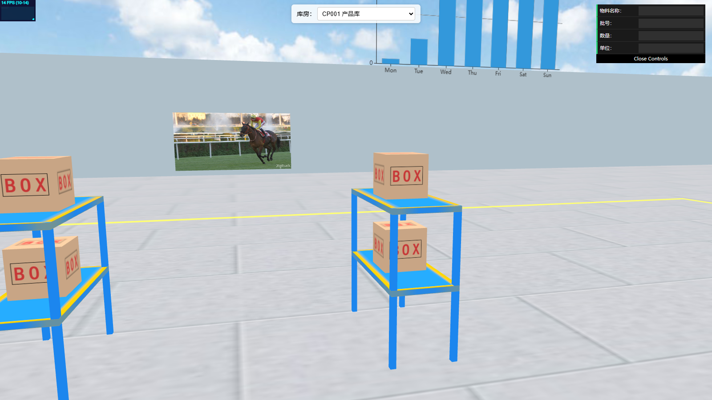

**功能用途**：以 **3D（WebGL）** 形式对仓库/产线场景进行数字孪生可视化仿真，直观呈现库位货物、产能曲线与现场布局，支持视角漫游，用于数字化展示与空间管理。

**界面说明**：3D 场景中以立体货架/货箱表示库位与货物，左上提供产品/产线选择与产能柱状图，右上为控制面板（视角/参数）。可在场景中拖拽旋转、缩放查看。

> 提示：3D 场景依赖浏览器 WebGL 能力，建议使用支持硬件加速的现代浏览器以获得最佳体验。

<div style="page-break-after: always;"></div>

---

# 第 15 章 智能助手中心

智能助手中心接入通义千问大模型（DashScope，OpenAI 兼容接口），将 AI 能力嵌入查询与建模两类高频场景。

## 15.1 智能数据助手

**路径**：智能助手中心 → 智能数据助手（`/llm/chat/chat-ui`）

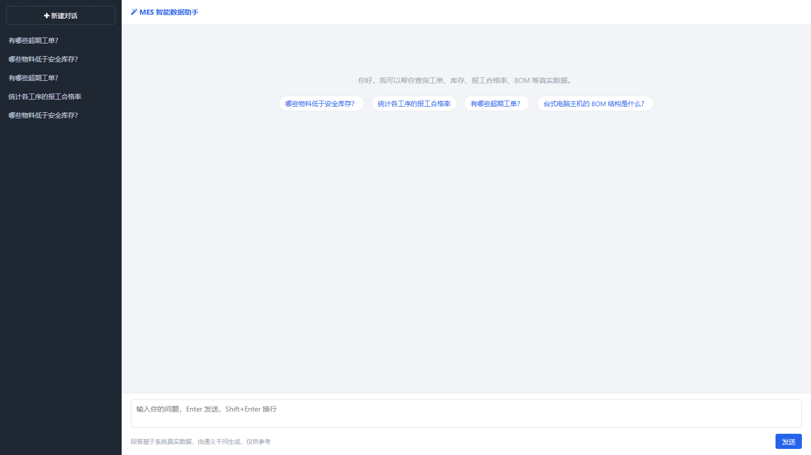

**功能用途**：以**对话**方式用自然语言查询系统真实数据（工单、库存、报工合格率、BOM 等）。后台采用 SSE 流式输出 + **工具调用**（如查询 BOM 结构、按工序统计合格率等），回答基于系统真实数据生成，仅供参考。

**界面说明**：左侧为会话列表与"新建对话"；中部为对话区，初始提供示例问题快捷卡片（如"哪些物料低于安全库存？""统计各工序的报工合格率""有哪些超期工单？""台式电脑主机的 BOM 结构是什么？"）；底部为输入框（Enter 发送，Shift+Enter 换行）。

**操作流程**：

1. 点击 **新建对话**（或点击示例问题）。
2. 在输入框输入问题，按 Enter 发送。
3. 助手以流式方式返回基于真实数据的答案；可在左侧切换历史会话。

## 15.2 AI 智能建模

**路径**：智能助手中心 → AI 智能建模（`/llm/bom-gen/gen-ui`）

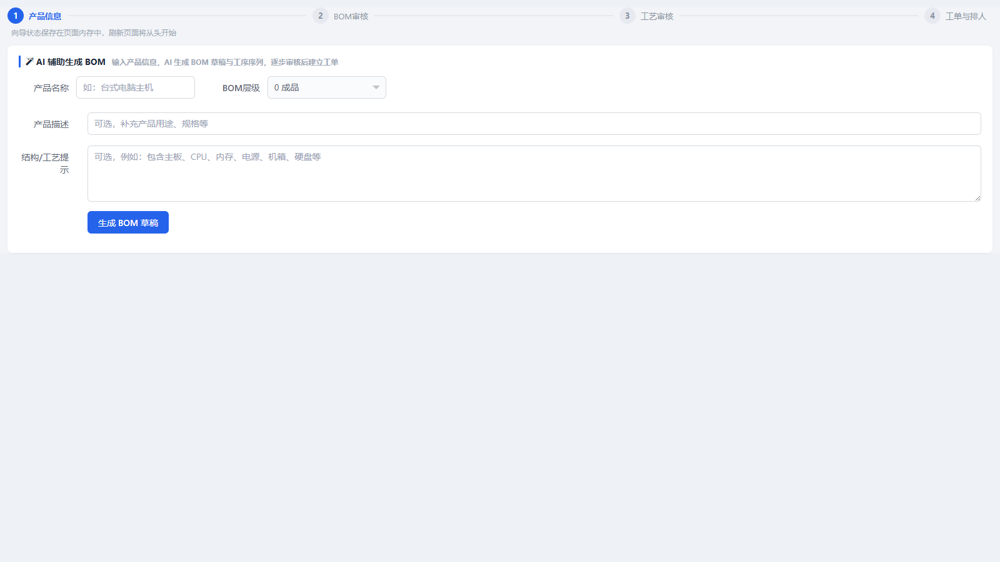

**功能用途**：以**四步向导**用 AI 辅助完成产品建模：输入产品信息 → AI 生成 BOM 草稿 → 工序/工艺补全 → 建立工单与排人。可由 AI 自动批量创建物料、零部件、BOM 与工序，大幅降低新品建模工作量。

**向导步骤**（顶部步骤条）：

| 步骤 | 名称 | 说明 |
| :--- | :--- | :--- |
| ① | 产品信息 | 输入产品名称、BOM 层级、产品描述、结构/工艺提示，点击"生成 BOM 草稿" |
| ② | BOM 审核 | 审核 AI 生成的 BOM 结构与物料（可补建缺失物料/零部件） |
| ③ | 工艺审核 | 审核/补全工序与工艺规划 |
| ④ | 工单与排人 | 建立工单并进行（负载均衡）排人 |

> 提示：向导状态保存在页面内存中，刷新页面将从头开始。

**操作流程**：

1. 第①步填写产品名称（如"台式电脑主机"）、选择 BOM 层级（如"0 成品"），在"结构/工艺提示"补充构成（如"包含主板、CPU、内存、电源、机箱、硬盘等"），点击 **生成 BOM 草稿**。
2. 第②步审核 BOM 草稿，确认无误后进入下一步（必要时自动补建物料/零部件）。
3. 第③步审核/补全工序与工艺。
4. 第④步建立工单并完成排人，形成可执行的生产准备。

<div style="page-break-after: always;"></div>

---

# 第 16 章 典型业务全流程演练

本章以演示数据"**台式电脑主机（PC_HOST）**"为主线，串联各模块，帮助新用户走通一条完整业务闭环。建议按序操作。

> 该产品由"台式电脑主机 → 台式电脑主机半成品 → 主板单元 / 机箱单元"逐层构成；工艺路线为：主板装配 → 机箱组装 → 主机装配 → 整机测试 → 包装入库。

**阶段一：主数据准备（基础数据中心）**

1. **物料信息定义**：建立成品/半成品/组件/零件物料（PC_HOST、CPU、MEMORY、PCB_BOARD、POWER_SUPPLY、CASE_SHELL 等），设置计量单位、安全库存、提前期、来源。
2. **班组员工定义**：建立 TEAM01 主板装配班组、TEAM02 机箱组装班组、TEAM03 总装测试班组并加入员工。
3. **加工单元定义**：建立"电脑组装单元/整机测试单元/包装入库单元"，绑定执行班组。
4. **设备 / 编组设备定义**：建立设备并按需编组。
5. **库房库位定义 + 库存管理**：建立 KF001 配件库、CP001 产品库及库位，初始化原材料库存。

**阶段二：产品与工艺设计（产品数据中心 + 工艺管理中心）**

6. **零部件定义 / 产品 BOM 管理**：建立三层 BOM（产品/半成品/组件），并**定版**。
7. **工序信息定义**：建立主板装配、机箱组装、主机装配、整机测试、包装入库等工序，归属加工单元。
8. **工艺路线管理**：编排工序时序（FLOW_PCHOST）。
9. **工艺流程管理**：选择已定版 BOM → 初始化工艺流程 → 逐节点绑定工序 → **锁定产品工艺规划**。
10. **工艺内容编制**：为各工艺节点编制作业内容至"已完成"。

**阶段三：计划与派工（生产计划中心 + 流程配置工具）**

11. **生产订单录入**：新增需求订单（产品 PC_HOST、数量、交期）。
12. **提交审核**：订单提交后由"流程办理"按订单审批流程审批通过。
13. **MRP 运算**：对已审核订单执行"运算"，生成物料需求明细。
14. **设备作业派工 / 员工作业派工**：为各工序绑定设备、（负载均衡）分配员工。

**阶段四：物料配套（生产计划中心 + 库房管理中心）**

15. **物料需求计划（明细）**：对净需求行 **申请** 并 **生成配套出库单**。
16. **配套出库确认**：库房按整单校验库存后确认出库，扣减库存并生成出库流水。

**阶段五：下发与执行（生产计划中心 + 计划管理 + 在制品管理）**

17. **生产计划下发**：对"待下发"计划 **拆分任务** 并下发，生成生产工单。
18. **生产工单查询 / 工单管理**：跟踪工单审批、动工、完工、交付状态（甘特图）。
19. **SN 通用过程采集**：现场按工艺路线逐站采集每个 SN 的 OK/NG 结果。
20. **完工交付**：工单完工交付后进入"已交付工单"，完成闭环。

**阶段六：成品入库与可视化（库房管理中心 + 数字化平台）**

21. **手工/计划入库确认**：成品按需入库登账并生成入库流水。
22. **库存明细 / 出入库流水查询**：核对库存与流水，全程可追溯。
23. **数字化平台 / 智能助手**：通过数据中心大屏与智能数据助手查看产量、合格率、库存等指标。

<div style="page-break-after: always;"></div>

---

# 第 17 章 附录

## 17.1 角色与权限

系统通过"用户 → 角色 → 菜单/数据权限"三级模型实现访问控制。预置角色及典型职责：

| 角色 | 编码 | 典型职责 |
| :--- | :--- | :--- |
| 系统管理员 | 888888 | 全系统配置、用户/角色/菜单维护 |
| 计划员 | 10002 | 生产订单、MRP、派工、计划下发 |
| 工艺员 | technologyRole | 物料/BOM/工序/工艺规划与内容编制 |
| 车间主管 | 10003 | 工单/派工审核、现场调度 |
| 现场班长 | 10004 | 班组任务分配与执行跟踪 |
| 操作工 | 10005 | 过站采集、现场作业 |
| 检验员 | 10006 | 质量判定、NG 处理 |

授权步骤：角色管理 →「授权菜单」勾选可见菜单 →「分配用户」加入成员；用户重新登录后生效。

## 17.2 状态值与字典

**通用软删除/状态约定**（字段 `is_deleted`）：

| 值 | 含义 |
| :--- | :--- |
| 0 | 正常 |
| 1 | 删除（软删，列表默认过滤） |
| 2 | 禁用 |

**关键业务状态**：

| 业务对象 | 状态流转 |
| :--- | :--- |
| 生产订单·审核状态 | 未审核 → 审核中 → 已完成 |
| 生产订单·MRP 状态 | 未运算 → 已运算 → 已完成 |
| 生产订单·下发状态 | 未下发 → 已下发 |
| 派工状态 | 未派工 → 已派工 |
| 工单·主状态 | 待审批 → 已审批 → 已下发 |
| 工单·完工/交付 | 待完工→已完工；待交付→已交付 |
| 入/出库单 | 待确认 → 已登账 |
| 配送状态 | 未申请 → 已申请 → 已完成 |
| 工艺规划 | 草稿 → 已锁定 |
| 流程实例 | 进行中 → 已完成 / 被驳回 / 已撤回 |

## 17.3 常见问题（FAQ）

**Q1：登录提示"请输入正确的验证码"？**
A：验证码为 4 位数字、区分本次会话；点击验证码图片可刷新后重新输入。

**Q2：工艺流程页面提示"请先选择已锁定的 BOM"，看不到工艺节点？**
A：工艺流程/内容/查询均需先点击"选择 BOM"载入；其中工艺内容编制与查询要求 BOM 已完成工艺规划锁定。

**Q3：生产订单无法下发？**
A：计划下发只展示"工单已审批 + 设备与员工派工均完成 + 等待下发"的计划，请先完成审批与两级派工，并完成物料配套出库。

**Q4：配套出库确认失败、库存未变化？**
A：配套出库按整单校验库存，存在任一物料库存不足时整单不出库、不扣减任何库存，请先补足库存或调整需求。

**Q5：删除了数据还能找回吗？**
A：系统为软删除（`is_deleted=1`），数据仍在库中，可由管理员通过数据库恢复；列表默认不再展示。

**Q6：菜单更新后用户看不到新功能？**
A：菜单需授权给对应角色，且用户需重新登录刷新权限缓存。

---

<div align="center">

**—— 全文完 ——**

黑科制造 MES 系统 · 产品说明书 V1.0 · 2026-06-13

</div>
