# MES 智能制造执行系统 · 产品设计书

| 项目 | 内容 |
| --- | --- |
| **产品名称** | MES 智能制造执行系统（Manufacturing Execution System） |
| **文档版本** | V1.0 |
| **文档类型** | 产品设计书 / 概要设计 + 详细设计 |
| **技术架构** | Spring Boot 单体应用（Java 11） |
| **代码主模块** | `mes/`，根包 `com.wangziyang.mes` |
| **编写日期** | 2026-06-13 |
| **适用读者** | 产品经理、研发工程师、测试工程师、实施交付、运维人员 |
| **密级** | 内部 |

---

## 文档目录

- [第 1 章 概述](#第-1-章-概述)
  - [1.1 编写目的](#11-编写目的)
  - [1.2 产品定位与背景](#12-产品定位与背景)
  - [1.3 设计目标](#13-设计目标)
  - [1.4 术语与缩略语](#14-术语与缩略语)
- [第 2 章 总体架构设计](#第-2-章-总体架构设计)
  - [2.1 技术架构分层](#21-技术架构分层)
  - [2.2 技术选型与栈](#22-技术选型与栈)
  - [2.3 业务域划分](#23-业务域划分)
  - [2.4 功能架构图](#24-功能架构图)
  - [2.5 部署架构](#25-部署架构)
- [第 3 章 核心技术框架设计](#第-3-章-核心技术框架设计)
  - [3.1 统一实体基类 BaseEntity](#31-统一实体基类-baseentity)
  - [3.2 统一返回结构 Result](#32-统一返回结构-result)
  - [3.3 统一分页 BasePageReq](#33-统一分页-basepagereq)
  - [3.4 雪花 ID 与自动填充](#34-雪花-id-与自动填充)
  - [3.5 软删除约定](#35-软删除约定)
  - [3.6 CRUD 模块范式](#36-crud-模块范式)
  - [3.7 Shiro 鉴权与权限模型](#37-shiro-鉴权与权限模型)
  - [3.8 前端自封装 sp* 组件体系](#38-前端自封装-sp-组件体系)
- [第 4 章 业务功能详细设计](#第-4-章-业务功能详细设计)
  - [4.1 系统管理域（system）](#41-系统管理域system)
  - [4.2 基础数据域（basedata）](#42-基础数据域basedata)
  - [4.3 工艺技术域（technology）](#43-工艺技术域technology)
  - [4.4 生产订单域（productionorder）](#44-生产订单域productionorder)
  - [4.5 工单执行域（order）](#45-工单执行域order)
  - [4.6 在制品追溯域（wip）](#46-在制品追溯域wip)
  - [4.7 仓储管理域（warehouse）](#47-仓储管理域warehouse)
  - [4.8 工作流引擎域（workflow）](#48-工作流引擎域workflow)
  - [4.9 数字化平台域（digitization / dst）](#49-数字化平台域digitization--dst)
  - [4.10 大模型智能域（llm）](#410-大模型智能域llm)
- [第 5 章 数据模型设计](#第-5-章-数据模型设计)
  - [5.1 核心实体关系图](#51-核心实体关系图)
  - [5.2 关键数据表说明](#52-关键数据表说明)
  - [5.3 数据库演进规范](#53-数据库演进规范)
- [第 6 章 关键业务流程设计](#第-6-章-关键业务流程设计)
  - [6.1 端到端主流程](#61-端到端主流程)
  - [6.2 工单状态机](#62-工单状态机)
  - [6.3 SN 过站追溯流程](#63-sn-过站追溯流程)
- [第 7 章 质量与问题分析（鱼骨图）](#第-7-章-质量与问题分析鱼骨图)
- [第 8 章 非功能性设计](#第-8-章-非功能性设计)
- [第 9 章 部署、运维与演示数据](#第-9-章-部署运维与演示数据)
- [附录 A 接口返回码与状态字典](#附录-a-接口返回码与状态字典)
- [附录 B 目录与命名规范](#附录-b-目录与命名规范)

---

## 第 1 章 概述

### 1.1 编写目的

本设计书面向制造执行（MES）领域，描述一套覆盖**基础数据 → 工艺设计 → 生产计划 → 工单派工 → 车间执行 → 在制品追溯 → 仓储管理 → 数据可视化 → AI 辅助**全链路的制造执行系统的产品与技术设计。目的在于：

1. 为研发团队提供一致的架构基线与模块范式，确保新增模块与既有代码对齐；
2. 为产品、测试、实施人员提供完整的功能说明与业务流程图；
3. 沉淀核心技术实现（权限、工作流引擎、SN 追溯、LLM 集成、3D 仿真）的设计思路与核心代码说明，降低维护成本。

### 1.2 产品定位与背景

MES 处于企业信息化金字塔的**中间层**——向上承接 ERP/PLM 下达的生产订单与物料清单，向下贯通车间设备、班组与在制品，解决"计划与执行之间的鸿沟"。

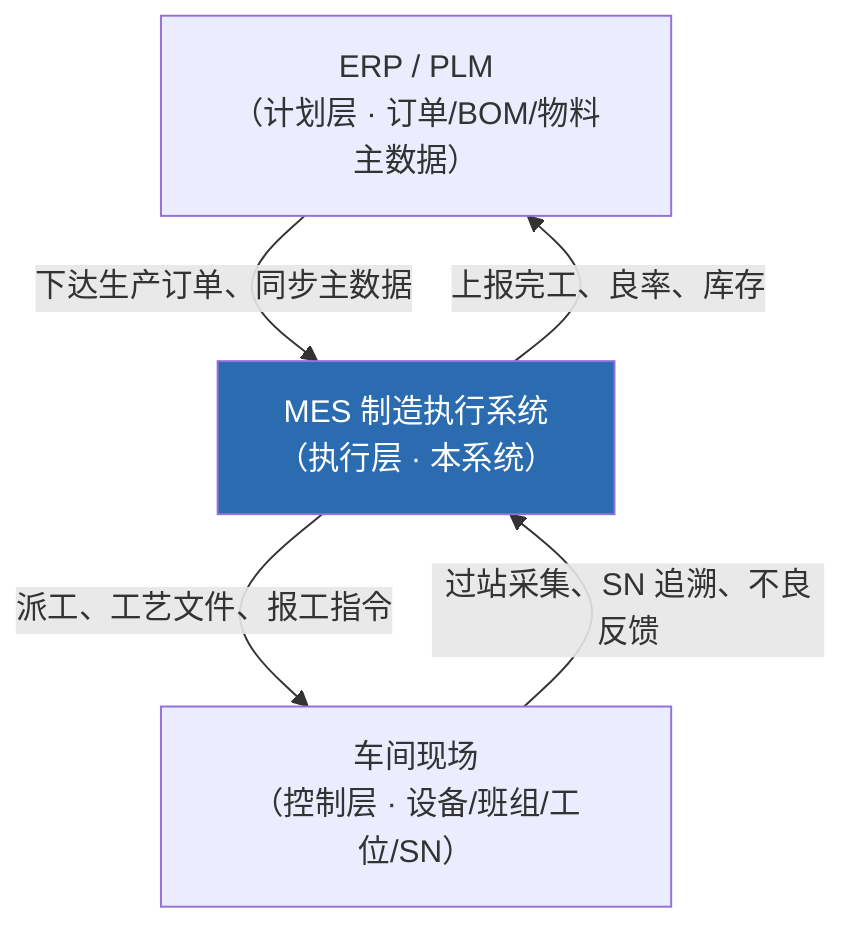

本系统以"**台式电脑主机**"为典型装配制造场景贯穿全链路演示数据，自上而下示范成品（FG）→ 半成品（PG）→ 组件（COMP）→ 零件（PART）的三层 BOM 与多工序装配过程。

### 1.3 设计目标

| 维度 | 设计目标 |
| --- | --- |
| **业务完整性** | 覆盖 MES 五大核心域：基础数据、工艺、计划/工单、执行追溯、仓储 |
| **一致性** | 所有 CRUD 模块遵循统一范式（实体/控制器/分页/软删除/唯一校验） |
| **可追溯** | 以 SN 为粒度记录每道工序过站结果（OK/NG），支持正反向追溯 |
| **可视化** | 提供深色科技风实时数据大屏 + 3D 数字孪生仓库 |
| **智能化** | 集成通义千问大模型，实现对话式数据助手与 AI 辅助建模向导 |
| **可扩展** | 内置通用工作流引擎，业务审批（订单/工单变更）以配置驱动 |
| **可维护** | 数据库变更全部脚本化（`scripts/sql/*-upgrade-*.sql`），可重复执行 |

### 1.4 术语与缩略语

| 缩略语 | 全称 | 说明 |
| --- | --- | --- |
| MES | Manufacturing Execution System | 制造执行系统 |
| BOM | Bill of Materials | 物料清单，本系统支持三层层级 |
| SN | Serial Number | 序列号，在制品追溯的最小粒度 |
| MRP | Material Requirement Planning | 物料需求计划 |
| WIP | Work In Process | 在制品 |
| FG/PG/COMP/PART | Finished Goods / Part Group / Component / Part | 物料四类型：成品/半成品/组件/零件 |
| 工艺路线 | Process Route / Flow | 工序的有序集合（`sp_flow`） |
| 加工单元 | Processing Unit | 承担某工序的工位/资源单元 |
| LLM | Large Language Model | 大语言模型（通义千问 DashScope） |
| SSE | Server-Sent Events | 服务器推送事件，用于流式对话 |

---

## 第 2 章 总体架构设计

### 2.1 技术架构分层

系统采用经典 **MVC 分层 + 领域分包** 的 Spring Boot 单体架构。各层职责清晰、依赖单向向下。

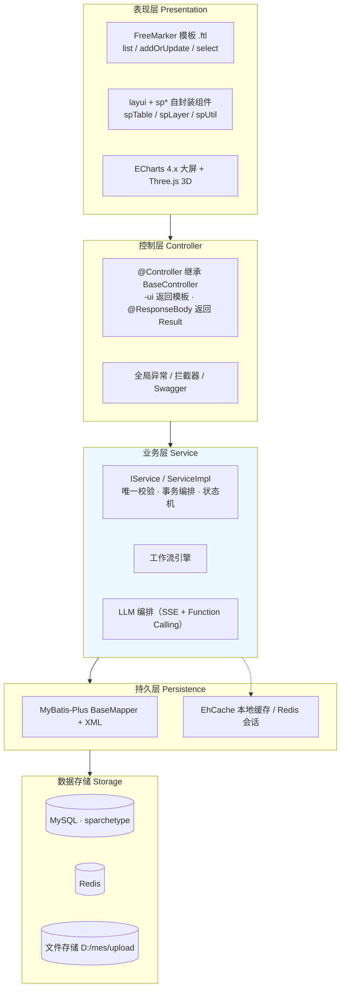

**分层职责约定：**

- **表现层**：FreeMarker 服务端渲染 `.ftl`，配合 `static/js/layuimodule/sp/` 下自封装组件交互；可视化由 ECharts/Three.js 承担。
- **控制层**：`@Controller` 统一继承 `common.BaseController`；`*-ui` 的 `@GetMapping` 返回模板路径字符串；数据接口 `@PostMapping + @ResponseBody` 返回 `common.Result`。
- **业务层**：`IService`/`ServiceImpl` 封装业务规则、唯一性校验、跨表事务与状态流转。
- **持久层**：MyBatis-Plus 提供单表 CRUD，复杂联表写在 Mapper 接口 + `mapper/{域}/XxxMapper.xml`。

### 2.2 技术选型与栈

| 分类 | 选型 | 版本/说明 |
| --- | --- | --- |
| 语言/运行时 | Java | 11 |
| 应用框架 | Spring Boot | `spring-boot-starter-web` |
| ORM | MyBatis-Plus | 含分页插件、代码生成器 `mybatis-plus-generator` |
| 数据库 | MySQL | dev 连 `127.0.0.1:3306/sparchetype` |
| 连接池 | Druid | `druid-spring-boot-starter` |
| 缓存 | EhCache + Redis | EhCache 本地缓存；Redis（Jedis）会话/共享 |
| 鉴权 | Apache Shiro | `shiro-spring` + `shiro-ehcache` + `shiro-freemarker-tags` |
| 模板引擎 | FreeMarker | 服务端渲染 `.ftl` |
| 前端 | layui + 自封装 sp* | `spTable`/`spLayer`/`spUtil` |
| 可视化 | ECharts 4.2.0 / Three.js | 数据大屏 / 3D 数字孪生 |
| 工具库 | Hutool（hutool-all）| HTTP、JSON（注意 5.1.5 用 `put` 非 `set`） |
| Excel | EasyExcel | 导入导出 |
| 接口文档 | Springfox Swagger2 | `swagger.enable=true` |
| 日志 | Logback + logstash-encoder | `classpath:logback.xml` |
| 大模型 | 通义千问 DashScope | OpenAI 兼容接口，模型 `qwen-plus`，Key 走环境变量 `DASHSCOPE_API_KEY` |

**构建与运行**（必须通过项目内 Maven settings 调用，指定阿里云镜像 + 项目内本地仓库）：

```powershell
# 启动应用（跳过测试）
mvn -s .\.codex-maven-settings.xml -f .\mes\pom.xml -DskipTests spring-boot:run
# 仅编译验证
mvn -s .\.codex-maven-settings.xml -f .\mes\pom.xml -DskipTests compile
```

启动后访问 `http://localhost:9090`（`server.port=9090`，无 context-path），默认 profile = `dev`。

### 2.3 业务域划分

代码以业务域分包，每个域内固定 `controller / entity / mapper / request / service / service.impl` 子结构。

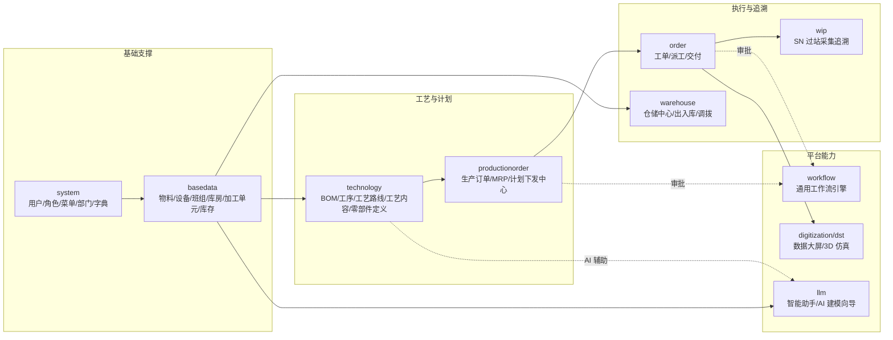

**12 个业务包一览：**

| 包 | 域名称 | 核心职责 |
| --- | --- | --- |
| `system` | 系统管理 | 用户、角色、菜单、部门、字典、登录、个人中心 |
| `basedata` | 基础数据 | 物料、设备、设备编组、班组、加工单元、库房库位、库存、字典 |
| `technology` | 工艺技术 | BOM（三层）、BOM 项、零部件定义、工序、工艺路线、工艺内容、工艺查询、工序-工艺关系 |
| `productionorder` | 生产订单 | 生产订单录入、MRP 物料需求计划、生产计划下发中心 |
| `order` | 工单执行 | 工单、工序派工（人/设备）、已交付工单 |
| `wip` | 在制品 | SN 扫码过站采集与追溯 |
| `warehouse` | 仓储 | 仓储管理中心、入库申请、出入库流水、配套出库、调拨分配 |
| `workflow` | 工作流 | 分类/模型/定义/表单/实例/任务/事件，通用审批引擎 |
| `digitization` | 数字化 | 实时数据大屏、计划数据看板 |
| `dst` | 数字孪生 | 3D 仿真仓库场景 |
| `llm` | 大模型 | 对话式数据助手、AI 辅助 BOM/建模向导 |
| `common` | 公共 | 基类、统一返回、配置、工具、全局异常、文件上传 |

### 2.4 功能架构图

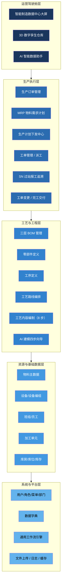

### 2.5 部署架构

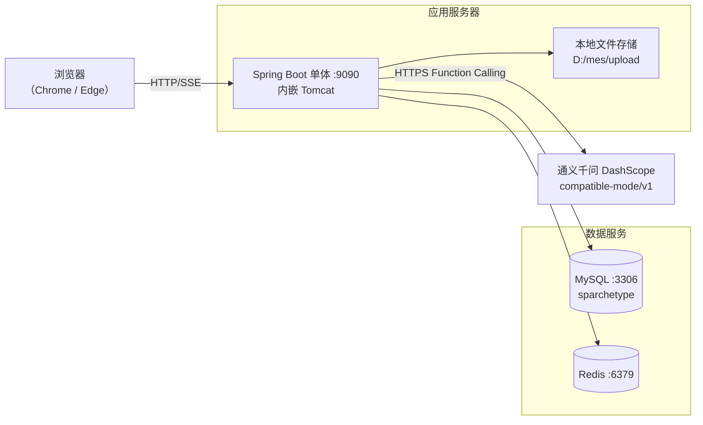

> 说明：当前为单体单实例部署，会话超时 30 分钟（`server.session-timeout: 1800`）。文件上传上限单文件 20MB、单请求 50MB。生产环境（`application-pro.yml`）通过 profile 切换数据源。

---

## 第 3 章 核心技术框架设计

本章描述贯穿所有业务模块的公共技术底座，是"一致性"设计目标的落地。

### 3.1 统一实体基类 BaseEntity

**设计思路**：所有业务实体继承统一基类，由框架自动注入主键与审计字段（创建人/时间、更新人/时间），消除样板代码，保证审计字段全局一致。

**核心代码**（`common/BaseEntity.java`）：

```java
public class BaseEntity implements Serializable {
    /** 主键：雪花算法生成的字符串 ID */
    @TableId(type = IdType.ID_WORKER_STR)
    private String id;

    /** 创建时间：仅插入时自动填充 */
    @TableField(fill = FieldFill.INSERT)
    private LocalDateTime createTime;

    @TableField(fill = FieldFill.INSERT)
    private String createUsername;

    /** 更新时间：插入与更新均自动填充 */
    @TableField(fill = FieldFill.INSERT_UPDATE)
    private LocalDateTime updateTime;

    @TableField(fill = FieldFill.INSERT_UPDATE)
    private String updateUsername;
    // getters / setters ...
}
```

**实现要点**：

- 主键策略 `IdType.ID_WORKER_STR`——MyBatis-Plus 内置雪花算法，生成 19 位有序字符串 ID，天然分布式友好、避免自增暴露业务量。
- `FieldFill` 配合自定义 `MetaObjectHandler` 在插入/更新时自动写入审计字段（创建人取当前 Shiro 登录用户）。
- 仅用于展示的联表字段不入库，统一标注 `@TableField(exist = false)`。

### 3.2 统一返回结构 Result

**设计思路**：前后端约定单一 JSON 信封 `{code, data, msg}`，前端 `sp*` 组件据此统一解析与提示。

**核心代码**（`common/Result.java`）：

```java
public class Result<T> extends HashMap<String, Object> {
    public static <T> Result<T> success(T data)            { return restResult(data, 0, "操作成功"); }
    public static <T> Result<T> success(T data, String msg){ return restResult(data, 0, msg); }
    public static <T> Result<T> failure(String msg)        { return restResult(null, 1, msg); }

    private static <T> Result<T> restResult(T data, int code, String msg) {
        Result<T> r = new Result<>();
        r.put("code", code); r.put("data", data); r.put("msg", msg);
        return r;
    }
}
```

**约定**：`code=0` 成功、`code=1` 失败；分页接口 `data` 为 MyBatis-Plus `IPage`，前端从 `res.data.records` / `res.data.total` 取值。

### 3.3 统一分页 BasePageReq

**设计思路**：所有列表请求对象继承 `BasePageReq`，直接复用 MyBatis-Plus `Page` 的 `current`/`size`，并扩展默认排序。

```java
public class BasePageReq extends Page {
    private String orderBy = "update_time"; // 默认按更新时间倒序
    // getter / setter
}
```

### 3.4 雪花 ID 与自动填充

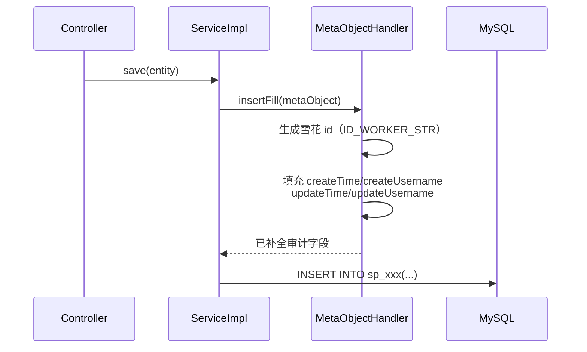

### 3.5 软删除约定

**设计思路**：业务数据不做物理删除，统一逻辑删除并区分"删除/禁用"两种失效语义，保证可追溯与可恢复。

| 字段 | 取值 | 含义 |
| --- | --- | --- |
| `is_deleted`（实体 `@TableField("is_deleted") private String deleted;`） | `0` | 正常 |
| | `1` | 已删除 |
| | `2` | 禁用 |

查询统一以 `ne("is_deleted","1")`（含禁用可见）或 `eq("is_deleted","0")`（仅正常）过滤。

### 3.6 CRUD 模块范式

**设计思路**：固化"实体—控制器—服务—Mapper—模板"五件套范式，任何新增模块照此对齐，降低认知成本。

```mermaid
flowchart LR
    E["实体 SpXxx<br/>extends BaseEntity<br/>@TableName(\"sp_xxx\")"]
    R["请求 SpXxxPageReq<br/>extends BasePageReq"]
    C["控制器 SpXxxController<br/>extends BaseController<br/>@RequestMapping(/域/模块)"]
    SVC["服务 ISpXxxService<br/>SpXxxServiceImpl<br/>唯一校验 isXxxCodeDuplicate"]
    M["Mapper SpXxxMapper<br/>+ XxxMapper.xml"]
    T["模板 list.ftl / addOrUpdate.ftl / select.ftl"]
    C --> SVC --> M
    R --> C
    E --> SVC
    T -.spTable POST.-> C
```

**接口约定**：

- `GET /域/模块/list-ui` → 返回模板路径字符串（页面）。
- `POST /域/模块/list` → `@ResponseBody` 返回 `Result(IPage)`（数据）。
- 保存前在 Controller 调用 `isXxxCodeDuplicate(code, excludeId)` 做唯一性校验（`ne is_deleted '1'`，编辑排除自身）。

### 3.7 Shiro 鉴权与权限模型

**设计思路**：基于 Apache Shiro 的 RBAC（用户—角色—菜单）模型，登录态以 Shiro Subject 承载，导航菜单按角色动态过滤；管理员角色 code `888888` 拥有全部菜单。

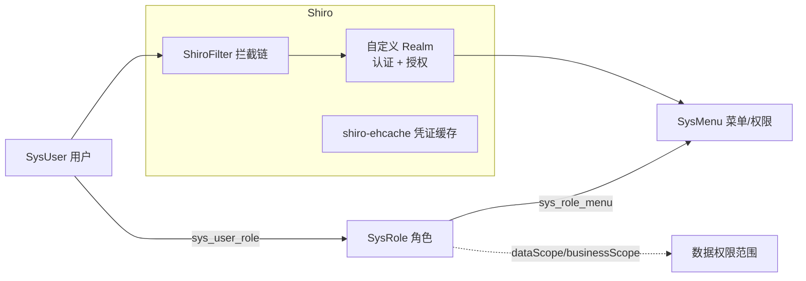

**核心实现要点**：

- 登录密码加盐摘要：`Md5Hash(password, username, 3)`（以用户名为盐、迭代 3 次）；演示管理员 `admin` 密码为 `123`。
- `BaseController.getSysUser()` 通过 `SecurityUtils.getSubject().getPrincipal()` 取当前登录用户，供审计字段与数据权限使用。
- 角色增强字段：`sortNum`/`isSystemRole`/`userType`/`roleCategory`/`dataScope`/`businessScope`，支持菜单授权、数据权限、分配用户三大操作。
- 预设 7 类业务角色：数据员、工艺员、生产计划员、生产主管、生产作业员、库房管理员、质量管理员。
- 导航菜单：`SysLoginController.tree()` 调用 `listIndexMenuTreeByRoleMenuIds` 按角色已授权菜单过滤渲染。

**核心代码（角色—菜单授权重建，幂等覆盖）**：

```java
// ISysRoleMenuService#rebuildByRoleId：先清后插，保证授权幂等
@Transactional(rollbackFor = Exception.class)
public void rebuildByRoleId(String roleId, List<String> menuIds) {
    remove(new QueryWrapper<SysRoleMenu>().eq("role_id", roleId));
    if (CollUtil.isNotEmpty(menuIds)) {
        List<SysRoleMenu> list = menuIds.stream()
            .map(mid -> new SysRoleMenu(roleId, mid)).collect(Collectors.toList());
        saveBatch(list);
    }
}
```

### 3.8 前端自封装 sp* 组件体系

**设计思路**：在 layui 之上封装 MES 专用组件，统一列表取数、弹层编辑、主从联动、选择回传等高频交互，配合统一 `Result` 信封降低页面编码量。

| 组件 | 职责 |
| --- | --- |
| `spTable.render` | POST 取数列表，`parseData` 读 `res.data.records/total`；`script[type=text/html]` 定义工具栏 |
| `spLayer.open` | 弹层编辑，`{content:'.../add-or-update-ui', spWhere:{id}, spCallback}` |
| `spUtil` | 通用工具（提示、请求、表单序列化） |

**主从布局范式**（选主表行 → 刷新从表），参考 `templates/basedata/team/list.ftl`。

**选择弹窗回传范式**：子页设置 `window.spChildFrameResult = {code:0, data:[...]}`，父页 `spCallback(res)` 接收（参考 `team/employeeSelect.ftl`、`processing-unit/team-select.ftl`）。

---

## 第 4 章 业务功能详细设计

> 本章逐域描述功能设计思路、实现方式与核心代码说明。每个域均遵循第 3 章范式，下文重点突出该域**独有的业务规则与关键实现**。

### 4.1 系统管理域（system）

**功能清单**：用户管理、角色管理（含菜单授权/数据权限/分配用户）、菜单管理、部门管理、数据字典、登录/登出、个人中心、系统工具。

**设计思路**：作为全系统的鉴权与组织基础，沿用 RBAC；菜单即权限点，存于 `sp_sys_menu`，新模块通过 SQL 脚本 `INSERT IGNORE` 注册并向管理员角色（`888888`）授权。

**核心控制器**：`SysUserController`、`SysRoleController`（6 个增强端点）、`SysMenuController`、`SysDepartmentController`、`SysDictController`、`SysLoginController`、`SysProfileController`、`SysToolController`。

**关键实现**：

- **菜单动态过滤**：登录后 `tree()` 仅返回当前用户角色授权的菜单子树，实现"千人千面"导航。
- **角色授权三件套**：`authMenu.ftl`（菜单授权树）、`dataScope.ftl`（数据权限）、`assignUser.ftl`（双列表分配用户）。
- **菜单注册规范**：

```sql
-- 新模块菜单注册（幂等）
INSERT IGNORE INTO sp_sys_menu(id, parent_id, name, url, ...) VALUES ('xxx_menu', 'parent', '模块名', '/域/模块/list-ui', ...);
-- 授权管理员
INSERT IGNORE INTO sp_sys_role_menu(role_id, menu_id)
SELECT r.id, 'xxx_menu' FROM sp_sys_role r WHERE r.code='888888';
```

### 4.2 基础数据域（basedata）

**功能清单**：物料主数据、设备、设备编组（编组—设备多对多）、班组（班组—员工）、加工单元（加工单元—班组）、库房/库位/库存、字典。

**设计思路**：所有制造活动的"资源池"。强调主从结构（编组↔设备、班组↔员工、加工单元↔班组）与笛卡尔积自动建模（库位）。

#### 4.2.1 物料主数据（SpMaterile）

四类型物料贯穿 BOM：`FG`成品 / `PG`半成品 / `COMP`组件 / `PART`零件，另含 `mat_source`（自制/采购）、`lead_time`（提前期）、`safety_stock`（安全库存）等字段，支撑 MRP 与 AI 建模。

#### 4.2.2 库房库位定义

**设计思路**：库房定义规格（组×排×层×列），保存时按**笛卡尔积自动生成库位**，编码规则 `库房码-组-排-层-列`（如 `KF001-1-2-3-4`）；改规格 = 软删旧库位全部重建。

**核心代码说明**（`SpWarehouseLocationServiceImpl.regenerateLocations`）：

```java
// 按 组×排×层×列 笛卡尔积生成库位
for (int g = 1; g <= specGroup; g++)
  for (int r = 1; r <= specRow; r++)
    for (int l = 1; l <= specLayer; l++)
      for (int c = 1; c <= specColumn; c++) {
        SpWarehouseLocation loc = new SpWarehouseLocation();
        loc.setLocationCode(whCode + "-" + g + "-" + r + "-" + l + "-" + c);
        loc.setWarehouseId(warehouseId);
        // ...组/排/层/列坐标
        locations.add(loc);
      }
saveBatch(locations);
```

> 该坐标体系同时被 [3D 数字孪生仓库](#49-数字化平台域digitization--dst) 直接读取用于三维可视化布局。

#### 4.2.3 库存（SpInventory）

按库房—库位—物料三维记录数量，是 MRP 实时重算与库房出入库流水的数据基础。库存终值与各类单据（手工入/手工出/计划入/配套出）严格对齐。

### 4.3 工艺技术域（technology）

工艺域是连接"产品定义"与"生产执行"的桥梁，是本系统最复杂的域之一。

**功能清单**：三层 BOM 管理、BOM 项、零部件定义、工序定义、工艺路线编排、工艺内容编制（8 步）、产品工艺查询、工序-工艺路线关系。

#### 4.3.1 三层 BOM 层级结构

**设计思路**：通过 `sp_bom_item.child_bom_id` 关联子 BOM，形成递归树，实现成品 → 半成品 → 组件 → 零件的**严格三层**结构（`PART` 类型不再递归）。

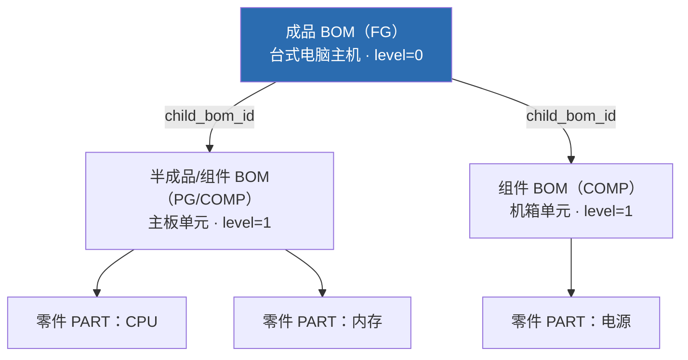

**实现要点**：

- `SpBom` 增 `bomLevel`；`SpBomItem` 增 `childBomId`、`itemMatType`。
- 树构建：`BomTreeNodeVO` + `SpBomItemMapper.listByBomHeadId`，前端 `tree.ftl` 渲染。
- **BOM 定版（lockBom）**：要求每个 PG/COMP 子项必须关联**已定版**子 BOM；保存全链时自上而下建子 BOM → 锁子 BOM → 产品 BOM 带 `childBomId` 保存 → 锁定版。
- 校验：`level=0` 表头须为 FG/PRODUCT 物料且在 `sp_component_def` 有启用记录，子项只能 PG/COMP。

#### 4.3.2 工艺内容编制（8 步）

`SpProcessContent` 按节点维护工艺内容（步骤说明、要求、注意事项、工艺文件、备料清单、设备/物料关系等）。状态机：`editing`（编制中）→ `completed`（已完成）。`checkNotLocked` 仅拦截 `editStatus=completed`，定版锁（`lockStatus=locked`）不影响内容编制。

#### 4.3.3 工艺路线编排

`SpFlow` + `SpFlowOperRelation` 定义工序有序集合（`sort_num` 排序），是工单执行与 SN 过站的"路线图"。

> 注意约定：`ISpFlowOperRelationService.addOrUpdate(SpFlowDto)` 内部以 BeanUtils 拷贝新对象保存，**不回填 dto.id**，创建后须按 flow 编码反查 `sp_flow` 拿 flowId；工艺路线至少 2 道工序。

### 4.4 生产订单域（productionorder）

**功能清单**：生产订单录入、MRP 物料需求计划、生产计划下发中心。

**设计思路**：承接 ERP/客户订单，经历"草稿 → 审批 → 派工 → 下发"多阶段，并以 MRP 校验物料齐套后下发工单。`SpProductionOrder` 含丰富的业务字段（客户、合同、结算、运输、MRP 状态等）。

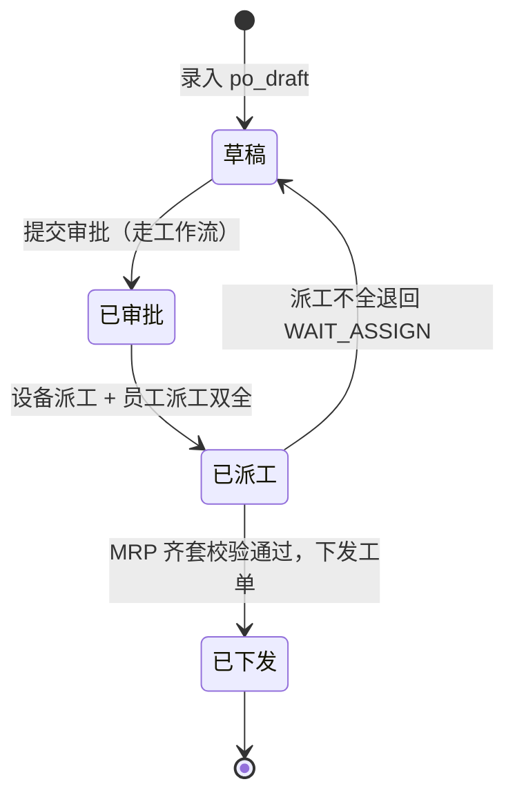

**MRP 设计要点**：

- `SpMaterialRequirementPlanMapper.pageList` 基于 `sp_inventory` **实时重算** 可用量/净需求（available/net）。
- 完成判定 `isProductionOrderMrpCompleted` 使用**库内存储净需求**（区别于实时重算），支撑"曾短缺→已补足"的状态演进。
- 下发/派工页排除 `DISPATCHED` 状态订单（`canAssign`/`buildDispatchRows`）。

### 4.5 工单执行域（order）

**功能清单**：工单管理、工序派工（员工 `SpOrderOperAssign` / 设备 `SpOrderOperEquipmentAssign`）、已交付工单。

**设计思路**：工单（`SpOrder`）是车间执行的最小调度单元，绑定工艺路线（`flowId`），其状态由多维子状态组合驱动（审批/派工/下发/报工/完工/交付）。

**工单关键字段**：`statue`（主状态码）、`workStatus`（报工状态，如 `STARTED`）、`completeStatus`、`deliveryStatus`，以及一组派生展示字段（`*StatusName`）与控制位（`canComplete`/`canDeliver`/`completeBlockReason`）。

**负载均衡排人**（AI 向导 `/order/preview-assign`）：工序 → `unitId` → `sp_processing_unit_team` → `sp_team_employee`，按 `sp_order_oper_assign` 未完成任务数最少者择优分配，实现负载均衡。

```java
// 负载均衡：在该工序加工单元下的候选员工中，选未完成任务最少者
// SpOrderOperAssignMapper.pickCandidatesByUnit 返回按未完成数升序的候选
List<Candidate> candidates = assignMapper.pickCandidatesByUnit(unitId);
Candidate picked = candidates.get(0); // 任务最少
```

### 4.6 在制品追溯域（wip）

**功能清单**：SN 扫码过站采集与正反向追溯。这是 MES "可追溯"目标的核心落地。

**设计思路**：以 SN 为粒度，沿工单绑定的工艺路线顺序过站，每站记录 OK/NG。系统自动计算"当前应做工序"，防止跳站/重复过站；全部 OK 即完工。

**核心代码说明**（`SpSnProcessRecordServiceImpl.scan`，节选）：

```java
@Transactional(rollbackFor = Exception.class)
public Result scan(SpSnScanReq req) {
    // 1. 入参校验：SN、工单、OK/NG
    String status = StringUtils.defaultIfBlank(req.getStatus(), "OK").toUpperCase();
    SpOrder order = orderService.getById(req.getOrderId());
    if (StringUtils.isBlank(order.getFlowId())) return Result.failure("工单未绑定工艺路线");

    // 2. 取工艺路线（有序工序）与该 SN 已完成工序
    List<SpFlowOperRelation> route = routeByFlowId(order.getFlowId());
    Set<String> done = completedOperIds(order.getId(), sn);

    // 3. 定位"当前应做工序" = 路线中第一个未完成工序
    SpFlowOperRelation current = route.stream()
        .filter(r -> !done.contains(r.getOperId())).findFirst().orElse(null);
    if (current == null) return Result.failure("该 SN 已完成全部工序");

    // 4. 防重复过站：当前工序已 OK 不允许再次 OK
    if ("OK".equals(status) && hasOkRecord(order.getId(), sn, current.getOperId()))
        return Result.failure("该 SN 当前工序已采集 OK，不能重复过站");

    // 5. 落记录 + 把工单标记为已开工（STARTED）
    SpSnProcessRecord record = buildRecord(sn, order, current, status, req.getRemark());
    save(record);
    markWorkOrderStarted(order);

    // 6. 计算下一工序，返回路线状态用于前端进度条
    if ("OK".equals(status)) done.add(current.getOperId());
    SpFlowOperRelation next = route.stream()
        .filter(r -> !done.contains(r.getOperId())).findFirst().orElse(null);
    Map<String,Object> data = new HashMap<>();
    data.put("complete", next == null);
    data.put("nextOper", next);
    data.put("route", routeStatus(order.getId(), sn));
    return Result.success(data, next == null ? "SN 已完成全部工序" : "采集成功");
}
```

**追溯口径**：完成数 = 走到末道工序（maxStep）且 status=OK 的 distinct SN；良率/不良按 `sp_sn_process_record` 的 status（仅 OK/NG）统计；达成率 = 完成 SN / 工单 qty。该口径同时为数据大屏所复用。

### 4.7 仓储管理域（warehouse）

**功能清单**：仓储管理中心、入库申请（`SpMaterialInboundRequest`）、出入库流水（`SpWarehouseTransaction`）、配套出库、调拨分配（`SpWarehouseRequestAllocation`）。

**设计思路**：以单据驱动库存变动，支持手工入库、手工出库、计划入库（对接生产订单）、配套出库（按工单备料清单）。单据含 `WAIT_CONFIRM` 待确认态。

**实现注意**：`sp_warehouse_transaction` 无 `is_deleted` 列（物理记录流水）；库存终值需与所有单据增减严格对齐（如 CPU：25 计划入 + 15 计划入 = 40；POWER：200 − 5 手工出 = 195）。

### 4.8 工作流引擎域（workflow）

**功能清单**：工作流分类、模型、定义、表单、实例、任务、事件/事件日志、办理。这是一套**通用配置驱动审批引擎**，被生产订单审批、工单变更审批等业务复用。

**设计思路**：分层定义——分类（业务大类）→ 模型（流程模板）→ 定义（节点/流转）→ 实例（运行态）→ 任务（待办）→ 事件（流转记录）。审批流由数据配置驱动，业务侧只需触发实例并监听任务。

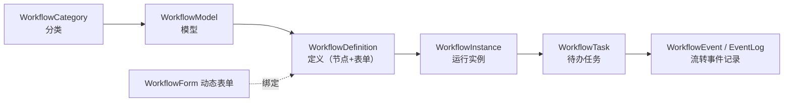

**核心实现要点**：

- `WorkflowSchemaInitializer`（`config/`）按开关 `mes.schema.init-menus`/Schema 初始化注入分类/模型/定义基础数据，幂等。
- `WorkflowPermissionUtil` + `WorkflowConstants` 统一权限点与常量。
- 节点 DTO：`WorkflowNodeDTO`、`WorkflowNodeEventDTO` 描述节点与事件。
- 业务接入：生产订单提交审批生成实例（订单审批），工单变更（`SpWorkOrderChange`，要求 `statue=5 + DISPATCHED`）生成变更审批实例。

### 4.9 数字化平台域（digitization / dst）

#### 4.9.1 智能制造数据中心大屏（digitization）

**设计思路**：深色科技风，全部**真实数据** + 30s 自动刷新，独立于旧 `planDemo` 假数据大屏。单接口 `POST /digitization/dashboard/data` 返回七分区聚合：`overview/orderStatus/processFlow/achievement/defect/inventory/personnel`，全部内存聚合，复用现有 Service，不写新 Mapper。

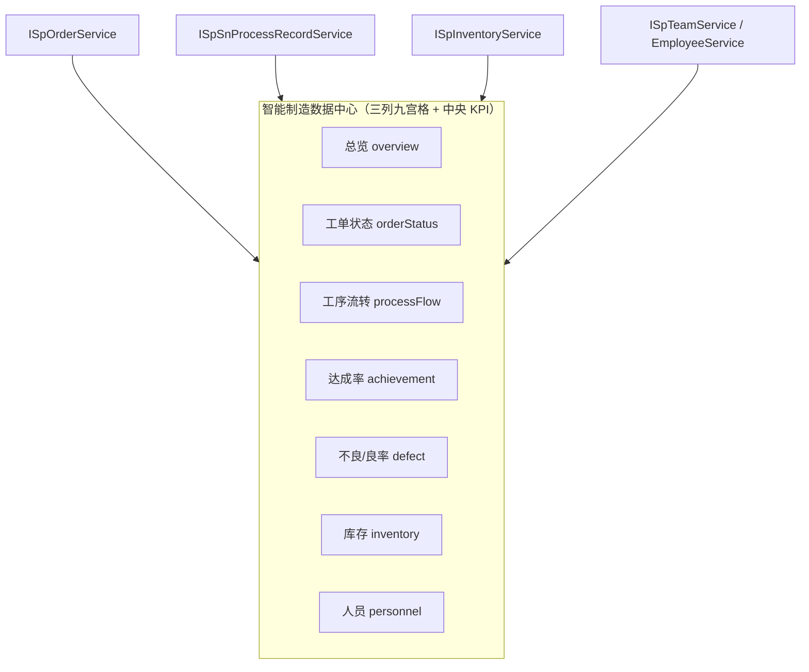

**实现注意**：前端 ECharts 为 **4.x（4.2.0）**——柱圆角用 `barBorderRadius`（非 v5 `borderRadius`），仪表盘用 `axisLine` 颜色分段表达进度（无 v5 progress/anchor）。

#### 4.9.2 3D 数字孪生仓库（dst）

**设计思路**：`DigitalSimulationController`（`/digital/simulation`）按所选库房一次性加载场景（`POST /scene`），以库位坐标（组/排/层/列）在 Three.js 中三维布局，库存货格直观可视。入库后需重新选择库房刷新场景。

### 4.10 大模型智能域（llm）

系统的两大旗舰智能能力，业务包 `com.wangziyang.mes.llm`，对接通义千问 DashScope（OpenAI 兼容接口）。

#### 4.10.1 智能数据助手（对话式 · SSE 流式 · Function Calling）

**设计思路**：对话式 UI + SSE 流式输出 + 函数调用。编排采用"**第 1 轮非流式拿 `tool_calls` → 执行只读工具 → 第 2 轮流式作答**"两段式，既能调用业务数据又能流式呈现。

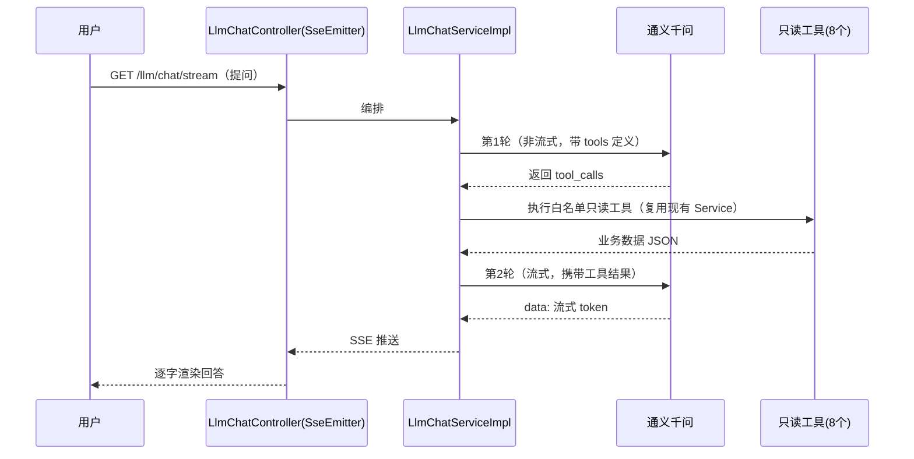

**8 个只读白名单工具**（`llm/tool/impl/`）：工单统计、超期工单、报工合格率、SN 追溯、库存预警、物料库存、BOM 结构、物料查询——全部复用现有 Service，**只读、白名单**，保证安全。会话/消息存 `sp_llm_conversation` / `sp_llm_message`。

**关键约束**：

- Hutool 5.1.5 `JSONObject` 无 `set(k,v)`，**必须用 `put(k,v)`**（可链式）；`JSONArray` 用 `add()`。
- HTTP 用 Hutool `HttpRequest`，流式 `executeAsync()` + `bodyStream()` 逐行读 `data:`。
- API Key 走环境变量 `DASHSCOPE_API_KEY`；SSE 异步线程池在 `llm/config/AsyncConfig`（`@EnableAsync`）。

#### 4.10.2 AI 智能建模四步向导

**设计思路**：将"从产品想法到可执行工单"的全过程拆为四步向导，AI 出草稿、人工审核、系统全链落库定版并自动排人。

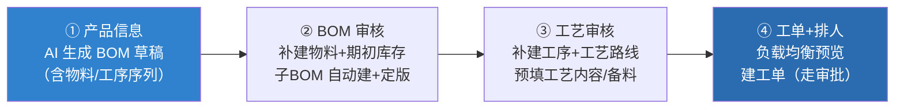

**各步实现要点**：

- **① 生成草稿**：prompt 输出 `items`（带 matType/matSource/leadTime/safetyStock）+ PG/COMP 子项带 `subParts` 子件清单 + `opers` 工序序列；`level=0` 子项强制纠偏为 COMP。
- **② BOM 审核全链保存**：`/material/batch-create` 补建未匹配物料（含期初库存写 `sp_inventory`，优先选无库存的空闲库位）+ FG 成品物料 + `sp_component_def` 零部件定义；`/bom/save-full` 自上而下建子 BOM → `lockBom` 子 BOM → 产品 BOM 带 `childBomId` 保存 → `lockBom` 定版。子件按物料编码 `LinkedHashMap` 去重合并数量。
- **③ 工艺审核**：`/flow/create` 补建缺失工序（`sp_oper`）+ 创建 `sp_flow` + `sp_flow_oper_relation`；`buildProcessRouteAndContent` 建规划树、绑工序、`lockAll`、预填工艺内容与备料清单（置 `edit_status=editing`，图片留人工补）。
- **④ 工单 + 排人**：`/order/preview-assign` 负载均衡预览，`/order/create-with-assign` 建工单（`statue=1` 走审批流）+ 写 `sp_order_oper_assign`。

**关键文件**：`llm/service/impl/LlmBomWizardServiceImpl.java`、`llm/controller/LlmBomWizardController.java`、`templates/llm/bomgen/index.ftl`（四步向导单页）。

---

## 第 5 章 数据模型设计

### 5.1 核心实体关系图

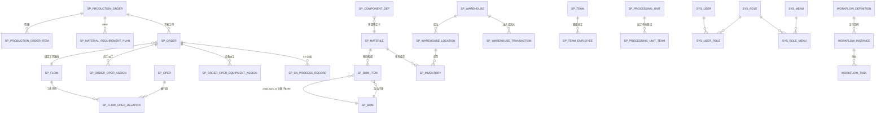

### 5.2 关键数据表说明

| 表名 | 域 | 说明 |
| --- | --- | --- |
| `sp_materile` | basedata | 物料主数据（四类型 + 提前期/安全库存） |
| `sp_bom` / `sp_bom_item` | technology | BOM 头/项，`child_bom_id` 形成三层树 |
| `sp_component_def` | technology | 零部件定义，BOM 定版前置 |
| `sp_oper` / `sp_flow` / `sp_flow_oper_relation` | technology | 工序 / 工艺路线 / 工序序列 |
| `sp_process_route` / `sp_process_content` | technology | 工艺规划树 / 工艺内容（8 步） |
| `sp_production_order` / `_item` | productionorder | 生产订单头/明细 |
| `sp_material_requirement_plan` | productionorder | MRP，基于库存实时重算 |
| `sp_order` | order | 工单（执行调度单元） |
| `sp_order_oper_assign` / `_equipment_assign` | order | 工序员工派工 / 设备派工 |
| `sp_sn_process_record` | wip | SN 过站记录（OK/NG） |
| `sp_warehouse` / `_location` / `sp_inventory` | basedata/warehouse | 库房/库位/库存 |
| `sp_warehouse_transaction` | warehouse | 出入库流水（无 is_deleted） |
| `sp_workflow_*` | workflow | 工作流引擎全套表 |
| `sp_llm_conversation` / `_message` | llm | 对话会话/消息 |
| `sp_sys_user/role/menu` 及关联表 | system | RBAC |

### 5.3 数据库演进规范

**设计思路**：无自动 Flyway/Liquibase，所有结构变更**脚本化、手动执行、可重复执行**，置于 `scripts/sql/`，命名 `{feature}-upgrade-YYYYMMDD.sql`。

幂等手段：`CREATE TABLE IF NOT EXISTS`、`INFORMATION_SCHEMA` 判断列是否存在再 `ALTER`、`INSERT IGNORE`、`NOT EXISTS` 子查询授权。

**执行注意**：必须加 `--default-character-set=utf8mb4` 否则中文乱码；PowerShell 管道会把中文写成 `?`，须用 `cmd /c` 重定向执行：

```bash
mysql --default-character-set=utf8mb4 -uroot -p****** sparchetype < scripts/sql/xxx-upgrade-YYYYMMDD.sql
```

---

## 第 6 章 关键业务流程设计

### 6.1 端到端主流程

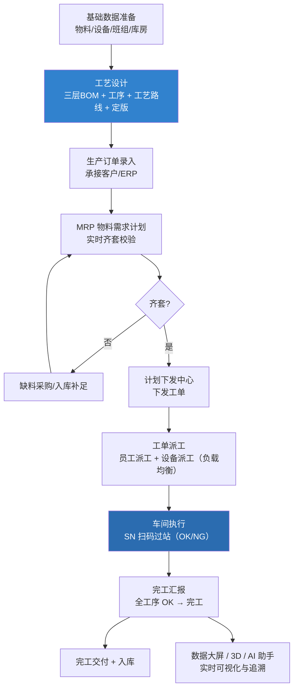

### 6.2 工单状态机

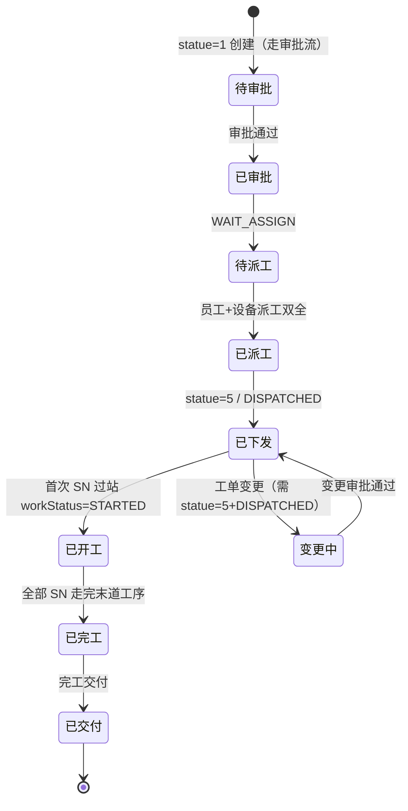

> 说明：下发/派工页**排除** DISPATCHED 状态订单；工单变更**要求** statue=5 + DISPATCHED——这是演示数据必须覆盖 `po_assign`（待下发）与 `po_disp`（已下发）两阶段订单的原因。

### 6.3 SN 过站追溯流程

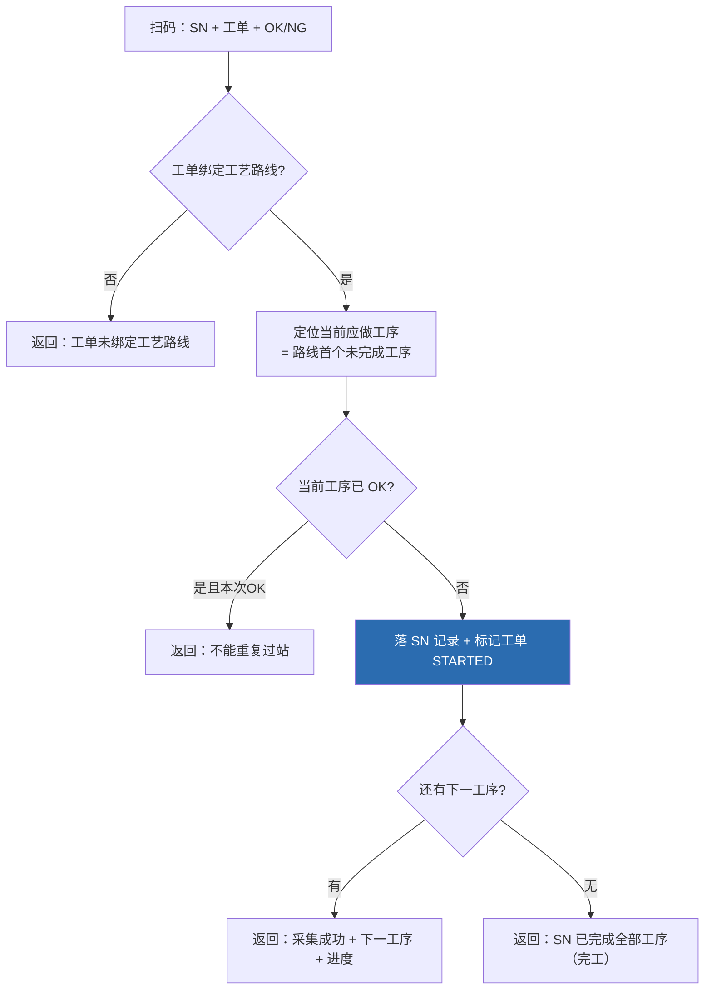

---

## 第 7 章 质量与问题分析（鱼骨图）

针对 MES 实施中最关心的质量目标"**降低生产交付延期率**"，采用鱼骨图（因果图）从 6M 维度系统分析根因，并标注本系统对应的设计对策。

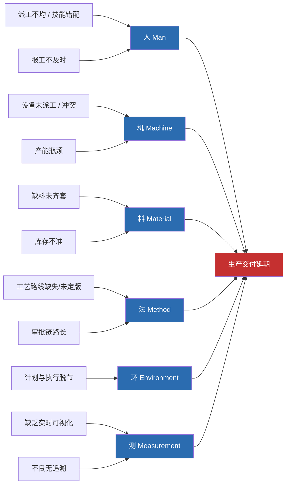

**根因 → 系统设计对策映射表：**

| 维度 | 根因 | 本系统设计对策 |
| --- | --- | --- |
| 人 | 派工不均、技能错配 | 工单派工**负载均衡算法**（按未完成任务最少择人），AI 向导第④步自动排人 |
| 人 | 报工不及时 | SN 扫码过站，首站即置工单 `STARTED`，实时回流大屏 |
| 机 | 设备未派工/冲突 | 工序**设备派工**（`SpOrderOperEquipmentAssign`），下发前校验设备+员工双全 |
| 料 | 缺料未齐套 | **MRP 实时重算**（基于 `sp_inventory`），齐套校验通过方可下发 |
| 料 | 库存不准 | 单据驱动库存变动，库存终值与流水严格对齐 |
| 法 | 工艺缺失/未定版 | BOM/工艺路线**定版（lock）**机制，未定版不可下发；AI 向导自动补建并定版 |
| 法 | 审批链路长 | **通用工作流引擎**配置驱动，订单/工单变更标准化审批 |
| 环 | 计划执行脱节 | 生产订单 → MRP → 下发 → 工单 → SN 全链贯通 |
| 测 | 缺实时可视化 | **数据大屏 30s 刷新** + 3D 数字孪生 + AI 数据助手 |
| 测 | 不良无追溯 | SN 级 OK/NG 记录，支持正反向追溯与良率统计 |

---

## 第 8 章 非功能性设计

| 维度 | 设计说明 |
| --- | --- |
| **性能** | 列表统一分页（MyBatis-Plus 分页插件）；大屏聚合走内存计算复用 Service；EhCache 缓存热点；Druid 连接池监控 |
| **安全** | Shiro 认证/授权 + 加盐密码（Md5Hash 3 次迭代）；LLM 工具**只读白名单**；API Key 走环境变量不入库；上传大小限制 |
| **可用性** | SSE 异步线程池隔离；工作流与业务解耦；会话 30 分钟超时 |
| **可维护性** | 统一范式 + 统一返回 + 软删除；数据库变更全脚本化、幂等可重复 |
| **可观测性** | Logback + logstash-encoder 结构化日志；Druid 监控；Swagger 接口文档 |
| **国际化/文案** | 提交信息、注释、UI 文案以中文为主，跟随现有风格 |
| **数据一致性** | 跨表操作 `@Transactional(rollbackFor=Exception.class)`；唯一性校验前置 |

---

## 第 9 章 部署、运维与演示数据

### 9.1 环境依赖

- JDK 11、Maven（须用项目内 `.codex-maven-settings.xml`）。
- MySQL（dev：`127.0.0.1:3306/sparchetype`）、Redis（`127.0.0.1:6379`）。
- 环境变量 `DASHSCOPE_API_KEY`（启用大模型能力）。

### 9.2 启动步骤

```powershell
# 1. 准备数据库结构 + 演示数据（utf8mb4，cmd 重定向）
#    先按需执行 scripts/sql/*-upgrade-*.sql，再执行全链演示数据
mysql --default-character-set=utf8mb4 -uroot -p****** sparchetype < scripts/sql/demo-data-full-reset-20260613.sql

# 2. 设置大模型 Key
$env:DASHSCOPE_API_KEY="sk-..."

# 3. 启动
mvn -s .\.codex-maven-settings.xml -f .\mes\pom.xml -DskipTests spring-boot:run
# 访问 http://localhost:9090 ，管理员 admin / 123
```

### 9.3 演示数据全链路

`scripts/sql/demo-data-full-reset-20260613.sql` 为全模块版入口，一次重建：部门 → 班组/员工 → 设备/编组 → 库房/库位/库存 → 物料 → 零部件 → 三层 BOM（台式电脑主机）→ 工序 → 加工单元 → 工艺路线 → 三阶段生产订单（草稿/待下发/已下发）→ SN 采集 → 仓储单据 → 工作流实例/任务。三阶段订单覆盖不同页面，确保各模块均有可演示数据且互不矛盾。

### 9.4 改动验证

> 改完代码必须用 `compile` 命令编译验证；数据库结构变更必须新增 `*-upgrade-*.sql` 脚本并执行，不直接改库结构而不留脚本。

---

## 附录 A 接口返回码与状态字典

**统一返回码（Result.code）：**

| code | 含义 |
| --- | --- |
| 0 | 成功 |
| 1 | 失败 |

**软删除（is_deleted）：** `0` 正常 / `1` 删除 / `2` 禁用。

**SN 过站结果：** `OK` 合格 / `NG` 不良。

**工单主状态（statue，节选）：** `1` 待审批 / `2` 已审批已派工 / `5` 已下发（DISPATCHED）。

**物料类型：** `FG` 成品 / `PG` 半成品 / `COMP` 组件 / `PART` 零件。

**管理员角色 code：** `888888`。

## 附录 B 目录与命名规范

```
mes/src/main/
├── java/com/wangziyang/mes/
│   ├── {域}/                    # system/basedata/technology/...
│   │   ├── controller/          # @Controller，继承 BaseController
│   │   ├── entity/              # 继承 BaseEntity，@TableName("sp_xxx")
│   │   ├── mapper/              # BaseMapper + 自定义联表
│   │   ├── request/             # 继承 BasePageReq
│   │   ├── service/             # IService 接口
│   │   └── service/impl/        # ServiceImpl 实现
│   └── common/                  # 基类/Result/配置/工具/全局异常
└── resources/
    ├── mapper/{域}/XxxMapper.xml         # MyBatis XML
    ├── templates/{域}/{模块}/            # list.ftl / addOrUpdate.ftl / select.ftl
    └── static/js/layuimodule/sp/         # 自封装 sp* 组件
scripts/sql/{feature}-upgrade-YYYYMMDD.sql # 数据库迁移（手动、幂等）
```

**命名约定：**

- 表名 `sp_xxx`（业务）/ `sp_sys_xxx`（系统）。
- 实体 `SpXxx` / `SysXxx`；控制器 `SpXxxController`；请求 `SpXxxPageReq`；服务 `ISpXxxService` + `SpXxxServiceImpl`。
- 软删字段 Java 端 `@TableField("is_deleted") private String deleted;`；仅展示联表字段 `@TableField(exist = false)`。

---

> **文档维护说明**：本设计书随系统演进同步更新。新增模块务必对齐第 3 章范式与附录 B 命名规范；任何数据库结构变更须配套 `scripts/sql/*-upgrade-*.sql` 迁移脚本。
